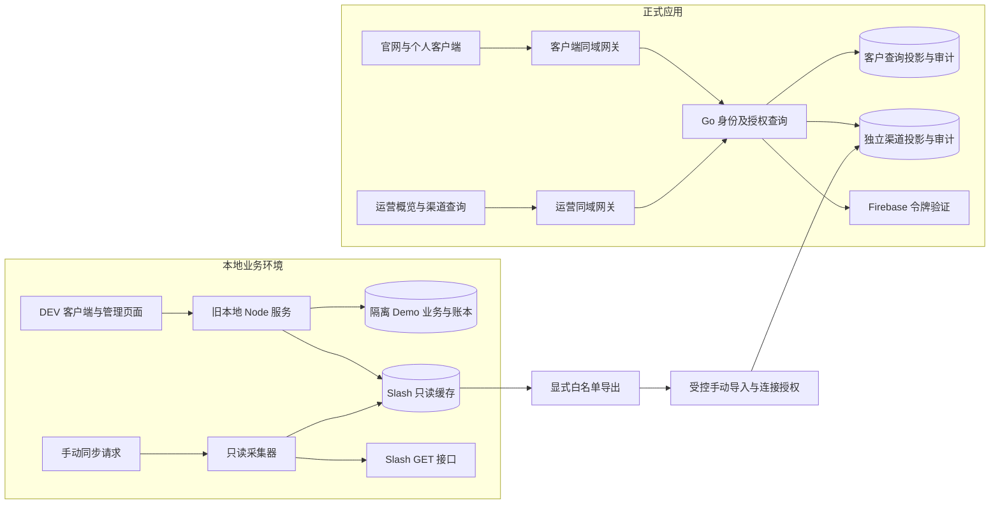

# 全站业务逻辑总览

整理日期：2026-09-07。本文供产品、运营和开发共同使用，说明用户从哪里进入、数据属于谁、操作改变什么，以及哪些流程仍仅在本地。最新已上传源码基线为 `0d5158d`，包含此前 `d9a5d40` 的概览与 DEV 日期筛选；本地开发目录的额外实现单独标记。源码存在、可在本地运行、已部署和真实业务验收是四个不同结论。

## 1. 全站由哪些部分组成

| 部分 | 服务对象与业务职责 | 当前交付范围 |
| --- | --- | --- |
| 官网 | 介绍广告营销、AI 订阅、订阅卡和云服务；引导咨询与登录 | 正式客户端应用的 `/`；咨询表单下载本地需求文件，没有提交到销售线索系统 |
| 正式客户端 | 个人客户登录、补全身份资料、查看已开通个人主体的账户和交易、安全设置 | Firebase + Go 查询；真实开卡、充值、兑换和出金未开放 |
| 正式运营后台 | 运营登录、MFA、权限查询、客户交易概览、渠道卡交易与基础卡资料 | `/workbench`、`/transactions`、`/cards/:id` 和安全入口；渠道查询另需独立授权，完整管理菜单不进入正式构建 |
| DEV 运营后台 | 客户与开户、卡片与 BIN、交易、费率、财务沙盒、审批及系统管理 | 仓库保留页面；依赖旧本地 Node 服务，各模块数据源不同 |
| DEV 客户端 | 卡片、资金、订单、消息和工单的产品流程演练 | 独立 Portal 原型；不是正式个人工作台的真实金融能力 |
| Slash 只读来源 | 本地采集渠道事实，再显式导出/导入正式 Go 独立投影 | 本地固定两组各 20 张选定卡，另有交易关联卡；正式导入不限定仅 40 张；没有自动持续更新或资金执行 |
| 账本与对账目标 | 内部分户、经济事项去重、三层核对、差异处置 | DESIGN；现有隔离账本机制和来源调查不能证明正式对账闭环 |

官网的“团队订阅方案”是服务介绍，不代表 V1 客户端提供团队成员、邀请或共享资金权限。官网注册页面也不代表已经完成开户。

### 运行与数据关系

正式 Go 读取已导入的渠道版本，尚不直接调用 Slash。客户投影与渠道投影分表、分授权、分审计，不合并余额或交易金额。正式 `/admin-api/v1`、本地 `/local-slash-demo` 和旧系统 API 不可互换。克隆仓库只得到已提交源码和导入工具，不包含旧采集服务、私有缓存、密钥或业务数据。

## 2. 先分清业务身份和数据归属

| 概念 | 负责什么 | 不能据此推断什么 |
| --- | --- | --- |
| Firebase 身份 | 证明登录者身份，提供已验证 token | 不等于本地用户已创建或客户服务已开通 |
| Go `users` | 平台登录用户及启停状态 | 不自动拥有资金账户或运营权限 |
| 客户主体 `customers` | 个人或企业业务归属与资源隔离 | 不等于登录身份；V1 前端只开放个人范围 |
| `staff_grants` | 给指定运营身份授予指定客户的资源读取权限 | 不等于全站管理员或全部渠道读取权 |
| `channel_read_grants` | 给已有 staff 身份授予指定渠道连接的投影读取权，仍需 MFA | 不授予客户归属、余额或卡片执行权；客户交易授权不自动生成它 |
| 本地内部用户与卡绑定 | 为本地卡片标记所属用户，保留版本、原因和审计 | 不自动给该用户资金授权，也不是历史交易归属快照 |
| 费率方案 | 用户覆盖、方案默认、系统默认的商业定价继承 | 不是客户团队，也不会自动改动独立 OTC 沙盒报价 |
| 渠道账户与卡片 ID | 定位来源连接内的事实 | 不证明内部客户归属或可执行余额 |

身份、开通和数据授权的具体顺序见 [正式身份与访问流程](identity-and-production.md)。

## 3. 按使用过程阅读业务流程

| 流程 | 起点 → 结果 | 关键状态与责任边界 | 详细说明 |
| --- | --- | --- | --- |
| 咨询与注册 | 官网了解服务 → 下载需求文件或进入登录/注册预览 | 本地文件下载不等于已发送咨询；表单通过不等于创建账户 | [正式身份](identity-and-production.md) |
| 正式客户进入 | Firebase 登录 → Go 用户确认/资料补全 → 读取已开通个人主体 | 用户注册、个人主体开通、资金账户开通分别处理 | [正式身份](identity-and-production.md) |
| 正式运营进入 | 批准邮箱登录 → 邮箱/MFA → Go 客户资源授权 → 资金概览 | 前置邮箱提示不是授权依据；每次查询仍由后端校验范围 | [正式接口与路由](routes-and-api.md) |
| 正式渠道调查 | 独立连接授权 → 交易筛选/分页 → 精确交易与卡资料 | 手动导入来源版本、完整性未知；尚未绑定客户，不开放给正式客户端 | [卡片与交易](cards-and-transactions.md) |
| 本地开户审核 | 客户资料 → `/approvals` → 内部用户审核状态 | 只属于本地用户管理；不是数字货币审批或正式 KYB 激活 | [资金与运营](funds-and-operations.md) |
| 产品到卡片 | 渠道/BIN 配置 → 本地产品上架 → 演示开卡 → 管理卡片 | 产品状态、来源卡状态、内部限制和资金子账分开 | [卡片与交易](cards-and-transactions.md) |
| 交易调查 | 已导入来源交易 → 状态/日期/卡片筛选 → 查看详情 | 状态两层保留；按渠道记录时间查询；缺少关系不自动认定退款归属 | [卡片与交易](cards-and-transactions.md) |
| 卡片控制 | 操作预览 → 申请/复核 → 执行 → 结果核查 | 只在隔离 Demo 中执行；真实卡未接入写通道；批准不等于成功 | [卡片与交易](cards-and-transactions.md) |
| 本地资金流转 | 充值申请、报价、兑换/提现订单 → 审批/执行/核对 | Portal 与数字货币沙盒是不同实现，不能跨模块合并余额或费用 | [资金与运营](funds-and-operations.md) |
| 运营看数 | 选择周期 → 后端聚合 → 趋势/状态/每日明细 | 正式 Go 与本地 Slash 分别计算；图表刷新不触发上游同步 | [运营概览口径](../frontend/operations-overview.md) |
| 对账与差异 | 来源异常调查 → 收集证据；未来再形成服务端对账批次 | 当前调查页面不证明资金池完整对平；缺期初或覆盖时为数据不足 | [对账目标](../domain/reconciliation-v1-plan.md) |

## 4. 管理后台的信息架构

以下为 DEV `/workbench` 使用的管理菜单。正式后台只有已开放的路由，不能根据菜单源码推断全部模块已上线。

| 导航领域 | 主要入口 | 运营任务 |
| --- | --- | --- |
| 总览与审批 | `/workbench`、`/approvals` | 看趋势与本地待办；开户审核列表及独立卡操作审批入口；数字货币出金另行审批 |
| 客户与开户 | `/user-groups/users`、`/customers` | 管理内部用户；查看来源 Demo 账户目录 |
| 卡片与交易 | `/card-bins`、`/cards`、`/transactions` | 维护产品、查卡和关联交易；记录本地归属 |
| 资金与财务 | `/finance/crypto-flows`、`/finance/otc`、`/finance/withdrawals`、`/finance/orders`、`/pricing`、`/reports` | 各资金子系统分别处理；费率统一入口；核对订单与流水 |
| 风险与合规 | `/risk`、`/reconciliation` | 来源状态及未匹配事项调查 |
| 经营分析 | `/operations`、`/demo/scenarios` | 来源 Demo 观察与场景演练 |
| 系统管理 | `/system/audit`、`/system/channels`、`/system/access`、`/system/settings` | 本地审计、接入状态、权限能力展示和页面配置 |

DEV 客户端主导航为工作台、资金中心、卡片中心、交易与账单、消息中心、帮助与工单、设置与开户。面向客户的团队功能已退出 V1；后台内部复核/财务角色仍保留。遗留源码中未被当前路由挂载的分析页和 OTP 页，不作为现行入口。

## 5. 金额、时间与完整性

| 数据或视图 | 金额口径 | 时间与完整性 |
| --- | --- | --- |
| 正式 Go 交易 | 正数最小单位字符串 + credit/debit；USD 与 USDT 分开 | `occurred_at`，查询投影不是账本 |
| 正式资金概览 | 仅 USD `succeeded` 进入收支；pending/failed 只计笔数 | 香港自然日 7/14/30 天；完成状态不证明来源结算 |
| 正式渠道卡交易 | 保留来源有符号 USD 最小单位与原币；无列表金额汇总 | 来源 `date`，UTC 起点含、截止不含；默认不限日期、每页 20 条、手动导入版本 |
| 本地 Slash 资金概览 | 来源 `posted` 的 USD 有符号金额；商户排行另限定已结算卡消费 | 香港自然日；固定窗口及来源覆盖仍可能不完整 |
| 本地卡交易列表 | 同一筛选范围内的来源 posted 汇总；原币另列 | UTC 自然日，按来源 `date`；结束日期含全天，自定义最多 30 天 |
| 本地资金/卡片账本 | 各自命名空间的精确金额、预占和内部凭证 | 演示资金，不与 Slash 渠道余额相加 |

全站应保持：已知零与未知分开、授权与入账分开、订单与交易分开、审批与执行分开、客户归属与资金权属分开。费用注释不重复扣款，跨币种不直接相加，净流量不命名为可用资金、收入或利润。详细规则见 [领域规范](../domain/transactions-and-funds.md)。

## 6. 已上传、已部署与本地新增

业务源码 `0d5158d` 在 `d9a5d40` 概览与 DEV 日期筛选之上加入正式渠道查询和商户标识。此前概览部署使用 `a42e2b9`，见 [历史记录](../../deploy/2026-09-07-operations-overview.md)；`2918584` 追加的 [渠道发布记录](../releases/channel-projection-2026-09-07.md)确认新版本已部署 Go 与两端 Worker，但本人登录后的业务验收仍待完成。本文只引用这些结果，没有重新部署、登录验收或检查生产数据库。

本轮还读取规范工作区的额外差异：五标签卡工作台、卡管理布局、客户端解冻申请和相关跳转。它们标为本地增量；已上传的正式基础卡资料页及商户标识单独记录。本次文档不顺带提交业务代码；若后续代码发布，需更新基线与能力标记。

当前待完成的主要链路：

1. 把选定本地业务迁入正式 Go，建立与个人主体、资源授权、MFA 和审计一致的接口。
2. 把现有本地采集 → 手动导入推进到获授权的正式采集作业、覆盖记录、事件接收及补同步；不能把手动缓存或导入版本当作实时全量来源。
3. 确认正式权威账本、内部卡分户、期初与科目、结算关系、日切和迁移切点。
4. 在上述基础上实现真实卡片指令与资金执行，单独完成审批、幂等、未知结果核查和业务验收。
5. 建立服务端内部账、业务账、来源资金池的三层核对；完成覆盖证据后才能作出资金匹配结论。

这些是依赖顺序，不是已授权的后续实施或上线计划。接口草案见 [financial 契约](../api/contract.md)，验收要求见 [资金场景](../testing/financial-scenarios.md)。

## 7. 文档维护与证据

阅读顺序：本页 → [身份与正式流程](identity-and-production.md) → [卡片交易](cards-and-transactions.md) / [资金运营](funds-and-operations.md) → [接口路由](routes-and-api.md) → 对应专题与源码。

本轮以路由、调用方、服务端处理、状态与金额规则作静态核对，校验 Markdown 链接及发布范围。此前自动化、渠道读取和部署证据保留各自日期，不当作本轮重新运行。具体核对范围见 [文档整理记录](../releases/2026-09-07-business-docs.md)。
