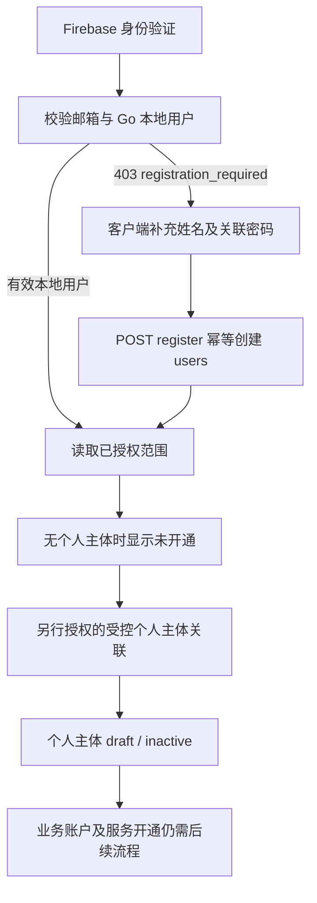

# 正式身份、客户主体与业务开通

更新日期：2026-09-07。本页依据业务源码 `0d5158d` 及发布记录提交 `2918584` 核对，包含 `d9a5d40` 后新增的正式渠道只读投影和商户 Logo。资金运营概览已有 `a42e2b9` 的[部署证据](../../deploy/2026-09-07-operations-overview.md)；[渠道投影记录](../releases/channel-projection-2026-09-07.md)已确认 `0d5158d` 的 Render 与两端 Worker 发布，已授权运营用户登录后的数据/详情验收仍未完成。本轮仅引用这些记录整理 Markdown，没有重新登录、创建身份、连接生产数据库、运行金融接口或部署。

## 1. 四种身份不能混为一谈

| 对象 | 实际职责与来源 | 创建后不会自动得到什么 |
| --- | --- | --- |
| Firebase 用户 | 验证密码、Google 身份和已绑定的第二因子；稳定标识为 UID | Moventra 本地用户、客户归属、运营权限 |
| `users` 登录用户 | 用唯一 `firebase_uid` 关联 Firebase；有 `active/disabled` 状态及显示姓名 | 客户主体、资金账户、卡片、余额 |
| `customers` 客户主体 | 个人所有权或企业成员关系，是业务数据归属边界 | 服务激活、资金服务或运营身份 |
| `accounts` 业务账户 | 归属某一客户；父账户外键限制在同一客户内 | 可用余额、支付授权或可执行金融能力 |

个人主体通过 `personal_owner_id` 唯一关联用户，一人最多一个个人主体；企业主体由 `memberships` 关联成员。现有数据模型允许同一用户加入多个企业，但当前 V1 客户端只展示个人主体。前端下线团队入口不删除这些历史模型、成员关系或资金归属。

`onboarding_status` 为 `draft/submitted/approved/rejected`，`service_status` 为 `inactive/active/suspended`，分别记录资料审核与业务服务。当前查询权限判断基于用户状态、所有权/成员关系或运营授权，并未要求主体已 `approved/active`；因此草稿主体可有获授权的只读查询，不能据此认为业务已经激活。账号、主体和账户各自的状态不能互相替代。

来源：[初始数据库结构](../../services/api/internal/database/001_initial.sql)、[查询与身份代码](../../services/api/internal/api/server.go)、[账户模型](../../services/api/docs/account-model.md)。

## 2. 注册与开通链路

独立 `/register` 页面仅校验姓名、邮箱和密码格式；提交后清空密码，不调用 Firebase 创建用户，也不向 Go 提交注册。官网咨询表单只在本地下载需求清单，不发送咨询或创建业务订单。

实际注册分流发生在已通过 Firebase 验证的客户端会话中：只有 `403 registration_required` 才进入资料补全。网络故障、停用用户、其他 403 或旧 `user_not_enabled` 不进入注册。常见入口是 Google 登录后尚无 Moventra 本地用户；判断依据是错误码与状态，而非 Google provider 本身。

资料补全会为尚未关联密码的当前 UID 调用 Firebase `linkWithCredential`；已有 password provider 不覆盖密码。密码仅交给 Firebase，不发送给 Go。随后 `POST /api/v1/register` 只提交姓名；Go 校验已验证的 Firebase token、JSON 类型、单个 JSON 对象和 1–80 字符姓名，拒绝额外字段。按唯一 UID 幂等插入 `users`，并发/重试不重复创建、不覆盖既有资料、不复活停用用户。若密码关联成功而 Go 创建失败，下次只重试业务创建。

注册本身不生成客户、成员、账户、运营授权或资金；该处理也不写客户级 `audit_events`，不能把其他管理查询的审计能力延伸为“注册已有完整开户审计”。

来源：[注册预览](../../apps/client/src/website/auth/RegisterPage.tsx)、[注册分流](../../packages/shared/src/auth/sessionState.ts)、[资料补全](../../packages/shared/src/auth/CompleteRegistration.tsx)、[Go 注册](../../services/api/internal/api/register.go)、[官网](../../apps/client/src/website/Website.tsx)。

### 受控运维命令的区别

下表是现有命令行为说明，不是执行授权。命令不经公开 HTTP 暴露；生产使用需明确指定身份和对应操作范围。

| 命令 | 已实现的前置检查 | 实际影响 |
| --- | --- | --- |
| `api provision-user` | 显式 UID/邮箱、Firebase 身份未禁用且匹配 | 仅幂等插入 `users`；允许先预开通未验证邮箱身份，但正常 API 仍要求邮箱验证；不重新启用既有 disabled 用户 |
| `api provision-personal` | 显式 UID/邮箱、Firebase 邮箱已验证且未禁用、本地用户 active | 锁定用户，创建或返回唯一 personal 主体；新建为 draft/inactive，仅首次创建写审计；不创建账户、成员或运营权限 |
| `api provision-operator` | 显式运营及客户所有人两组 UID/邮箱；双方本地 active；所有人邮箱已验证；拒绝相同身份与既有角色混用 | 仅为指定所有人已存在的个人主体授予 `accounts:read`、`transactions:read`，逐项幂等审计；不授权所有客户或未来客户 |
| `api import-channel` | 标准输入读取受限 JSON，显式 `PROJECTION_OPERATOR_UID`，本地 active 用户且已存在 staff_grants | 在独立渠道表内原子导入一个版本，并给该操作员追加本连接的 channel_read_grants 和导入审计；不创建客户或资金分录，不将本地 SQLite/渠道密钥直接上传 |
| `api migrate` | 独立迁移命令与对应环境配置 | 执行版本化结构迁移；普通服务启动不自动执行 |

运营身份可预授权，但未验证邮箱或未完成当次 MFA 仍不能读取管理业务数据。命令拒绝客户所有人已有 staff grants、运营身份拥有个人主体或企业成员关系的组合；它不自动清理或变更旧关系。这个受控开通命令的角色分离规则不等同于数据库内置全局角色互斥约束。

来源：[CLI 分支](../../services/api/cmd/api/main.go)、[个人主体关联](../../services/api/internal/database/personal.go)、[指定客户运营授权](../../services/api/internal/database/operator.go)。

`import-channel` 是受控数据库导入分支，不使用 HTTP Bearer，也不执行前述 Firebase provisioning 的在线 UID/邮箱核对；它依据显式 UID 对应的本地 active 运营用户授予独立连接读取权限。因此只应在批准的运维环境使用，不能描述为普通网页同步。公开渠道查询仍执行 Firebase、邮箱、用户状态及 MFA 检查。导入校验详见[导入实现](../../services/api/internal/projection/import.go)。

## 3. 两端登录、安全设置与会话

| 项目 | 正式客户端 | 正式运营后台 |
| --- | --- | --- |
| 入口 | `moventra.me/login` | `admin.moventra.me/login` |
| 方式 | 邮箱密码、Google | 批准邮箱密码；关闭 Google 与自助注册 |
| 前置邮箱名单 | 无运营名单限制 | 构建时 `VITE_ADMIN_LOGIN_EMAILS`，缺失时全部拒绝；仅用于登录提示 |
| MFA | 可绑定验证器；已绑定因子时由 Firebase 挑战 | 当次验证后的 token 必须符合 Go MFA 判断，才能进入业务页面及管理查询 |
| 业务首页 | `/session` 成功后进入 `/portal` | `/session` 满足 operator 与 MFA 后进入 `/workbench` |
| 安全与范围页面 | `/portal/security` | `/session?security=1` |

两端共用 Firebase 项目，但采用不同命名 SDK 实例、独立构建和内存会话；不是两个独立用户库或不同 token audience。刷新页面后需要重新登录。应用身份由各自 Vite 配置固定，不能通过 URL 选择 client/admin。

后台在 Firebase 密码请求前检查批准邮箱；随后等待 Go `/api/v1/me` 确认运营身份。Go 拒绝或出现异常时，前端退出 Firebase、清空会话并显示登录错误，不把“Firebase 返回 User”当作后台已登录。允许进入邮箱验证或 MFA 设置流程，也不等同于后台业务已经放行。

安全页可由持有人请求验证邮件、刷新身份、绑定 TOTP 验证器。绑定成功后退出并要求等验证码刷新后重新登录；没有自助绕过、删除或重置 MFA 的入口。找回密码页由持有人调用 Firebase 发送密码设置邮件，对不存在的邮箱维持统一成功提示；它不创建本地用户、变更运营权限或代替邮箱验证。

当前网页仅处理 TOTP 挑战和绑定；Go verifier 在完成 Firebase 签名、受众、发行方、有效期、撤销与邮箱校验后，认可可信 `sign_in_second_factor` 为 `totp` 或 `phone`。这说明服务端判断范围，不表示短信 MFA 已在产品页面接入或已做本轮真实验收；自报 `mfa` custom claim 不授予运营权限。

来源：[AuthContext](../../packages/shared/src/auth/AuthContext.tsx)、[登录页](../../packages/shared/src/pages/LoginPage.tsx)、[安全页](../../packages/shared/src/auth/SessionPage.tsx)、[Firebase 初始化](../../packages/shared/src/firebase.ts)、[站点约束](../../packages/shared/src/auth/site.ts)、[Go verifier](../../services/api/internal/api/auth.go)、[找回密码页](../../packages/shared/src/website/auth/ForgotPasswordPage.tsx)。

## 4. 授权的实际判定

正式请求使用同域 `Authorization: Bearer <Firebase ID token>`，前端 `credentials: omit`、`cache: no-store`，没有正式 Cookie 会话交换。Firebase token 不进入旧后台或本地 Demo 适配器。Go 每次重新验证 token 和撤销状态，用 UID 找本地 active 用户；邮箱、浏览器角色和客户下拉框不作授权依据。

| 查询 | 数据范围 | 额外边界 |
| --- | --- | --- |
| `/api/v1/me` | 本人个人主体、有效企业成员主体；Go 可返回运营 grant 信息 | `operator` 仅表示存在 staff grant；未完成 MFA 时 `staffScopes=[]`；不是全局管理员角色 |
| 客户端账户/交易 | 本人个人所有权或对应企业 active membership | 当前企业 owner/admin/viewer 都是该企业全范围只读；V1 页面只选个人主体，不代表 Go 已移除企业读能力 |
| 后台账户/交易 | 精确 `customer_id + accounts:read/transactions:read` grant | MFA；不存在与无权客户统一 404；授权、查询、审计在同一 Repeatable Read 事务；审计失败不返回数据 |
| 后台资金运营概览 | 当前用户拥有 `transactions:read` 的客户集合 | MFA；只有 accounts:read 不够；逐客户记录 `transactions:overview:read`；不顺带授予客户、账户、卡片或商户元数据权限 |
| 后台渠道只读投影 | 当前用户的独立 `channel_read_grants(connection_id,user_id)` | MFA + 至少一项既有 staff_grants + 本连接 grant；不是按客户 transactions:read 自动推导；读取与 channel_read_audit 在同一事务，失败不返回数据 |

Cloudflare 网关进一步分端：客户端禁止 `/admin-api/`，后台禁止 `/client-api/` 和注册；客户端 me 隐去 staffScopes 并归一为非运营视图，后台 me 拒绝非 operator、隐去客户所有权列表。这是站点边界，Go 本身仍按每个路由的服务端授权检查，不能把网关裁剪后的响应当成底层用户模型变更。

来源：[服务端查询](../../services/api/internal/api/server.go)、[总览授权](../../services/api/internal/api/overview.go)、[同域传输](../../packages/shared/src/auth/liveApi.ts)、[Cloudflare 网关](../../deploy/cloudflare/gateway.mjs)。完整路径差异见[路由与 API 范围](routes-and-api.md)。

渠道连接使用自身 `account_ref` 和来源定位，与 `customers/accounts/transactions` 分开。具有客户 `transactions:read` 不会自动取得连接权限；只有 channel_read_grants 而无任何 staff_grants 也不够。无任何可读连接返回 `403 channel_scope_required`，未获授权的具体连接/记录返回 404；`me.staffScopes` 仍只列客户权限，渠道范围通过单独连接端点发现。新增表和限制见[迁移 002](../../services/api/internal/database/002_channel_projection.sql)、[渠道查询](../../services/api/internal/api/channel.go)。

## 5. 当前正式业务闭环

**客户端个人查询**：读取 me 中的个人主体；无主体显示未开通，接口空列表显示暂无记录，失败单独显示。首页、账户页与交易页使用现有两个列表 API，每种最多前 50 条；首页数字是“已读取记录数”，不是全量客户资产或完整交易量。界面不提供真实开卡、充值、提现、转账或冻结。

**运营资金概览**：7/14/30 个香港自然日、USD、`occurred_at`、区间 `[from,to)`。只将内部 `succeeded` 的 credit/debit 投影分为流入/流出；pending/failed 只计笔数，USDT 不混入。资金计算使用精确整数字符串，不从第一页交易推导全量汇总。没有记录的日金额为 null，不证明零活动；coverage 始终说明完整性未知，未消除未经确认的内部转账，不能称为营收、利润、结算余额或可用资金。

总览支持手动刷新、周期切换、每日明细和当前结果 CSV；不会触发 Slash 同步。卡片、客户运营数和商户没有接入此概览统计源，仍保持不可用；新增渠道投影没有合并进这个客户 USD 聚合。`asOf` 是查询时点，`revision` 是当前聚合内容标识，不是渠道版本或持久化报告。细节见[概览契约](../../services/api/docs/operations-overview.md)。

**渠道卡交易与单卡资料（`0d5158d` 已上传并发布，登录后业务验收待完成）**：正式应用路由新增 `/transactions`、`/cards/:id?connection=...`，前端先要求 operator + MFA，后端再验证独立渠道权限。交易列表读取已导入来源记录，支持固定每页 20 条、商户/尾号/交易 ID、来源 detailedStatus、UTC 来源日期；金额、来源状态、授权/入账时间各自保留。详情可查询连接内的精确交易及关联卡，不从卡名推断内部客户；未绑定用户显示未绑定，余额和管理操作尚未接入。

刷新只查询已导入数据库，不抓取 Slash。连接保留 sourceAt、importedAt、当前 revision；分页使用当前版本，导入导致版本变化时返回 409 并要求刷新。历史导入版本保留，但公开 API 不提供按旧版本回看，详情也不固定列表版本。所有响应 `complete=false`、`syncMode=manual_import`；来源样本不代表完整资金池。

商户 Logo 已作为同一上传增量纳入组件和正式卡交易页。图标只依据规范品牌名展示；来源商户原文不替换，不将内部用户、卡片 ID、金额或完整订单描述发送给 Logo 服务。正式客户端仍无渠道记录归属映射，不展示这些未绑定客户的交易。来源：[ChannelTransactionsPage](../../apps/admin/src/operations/ChannelTransactionsPage.tsx)、[Logo 规范](../frontend/merchant-logos.md)。

**个人升级企业的服务端基础**：Go 与客户端网关保留申请提交/最新申请查询，但当前 V1 正式页面和 `liveApi.ts` 没有开放该调用入口。提交要求本人所有的 personal 主体、合法 UUID 幂等键和企业名称；首次创建 submitted 申请及审计，同键同内容返回原申请，同键不同内容冲突。GET 以当前 requested_by 读取该个人主体的最新申请。审核、材料、受益人、企业创建关联、服务激活与资产迁移没有公开 HTTP 实现；数据库约束不能当作审核流程已上线。来源：[upgrade.go](../../services/api/internal/api/upgrade.go)。

## 6. 上传、本地与生产证据

本页以远端 `0d5158d` 为最新业务基线重新读取路由、Go、网关、迁移及导入源码。规范工作目录仍较旧：新增 ChannelTransactionsPage、channel.go、导入包尚未全部同步回该目录，不能因为本地缺文件而将已经上传的渠道增量误判成未实现，也不能用旧本地文件覆盖远端。

商户 Logo、TransactionDrawer 和客户端 UnifiedTransactions 的该项组件增量已随 `0d5158d` 上传，不再列为未上传。当前仍有本地额外 DEV 卡详情/导航与解冻申请差异，涉及 `CardAdminPage.tsx`、`DashboardLayout.tsx`、`LiveSlashPage.tsx`、`CardCenter.tsx`、`portal/model.ts`；它们不等同新正式路由的实现，本轮文档不附带上传这些业务代码。

此前 `a42e2b9` 发布记录确认资金概览 admin Worker 与 Go 已发布、资源哈希一致、未认证/跨端请求被拒绝及健康检查通过；客户端 Worker 未随该次概览重新发布。后续 `2918584` 追加渠道增量发布记录：`0d5158d` 对应 Render `dep-daf3v90u01pc738o7s40` live、后台 Worker `2f7ca654-ec7c-476f-adf9-207e157d4803`、客户端 Worker `3cd4c6b8-7739-4f82-b8be-fa8445b6ee63`，并记载 260 张关联卡和 5573 条交易投影、拒绝检查及资源字节核对。上述为此前运行证据，本轮没有重复验证；运营用户本人登录后的 Logo、读取及详情跳转验收仍未完成。

`0d5158d` 已提供只读 SQLite 白名单导出与受控 JSON 导入代码；可将批准的脱敏渠道快照装入独立 PostgreSQL 投影，但这不同于迁移旧采集服务或上传原 SQLite 文件。导出文件为私有资料、不得提交 GitHub；Slash 凭据仍不进入云端，公开 HTTP 无导入、同步、凭据或资金写入口。资金账户、客户归属与总览旧 transactions 表不因此被修改。

后续完善开户、企业审核、卡片、资金、渠道、授权管理或 MFA 恢复，须分别补齐服务端契约、主体范围、审计及验收；本轮文档没有赋予新增金融执行权限。
