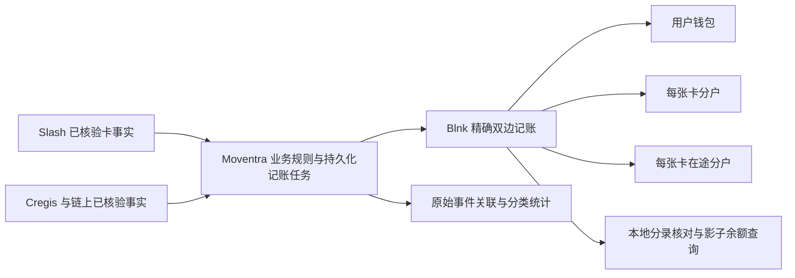

# Blnk 用户钱包与多卡分户接入

日期：2026-09-17。项目：Moventra，基线 `ce0a88a`，包含已有未提交角色/前端工作。本次为获授权的本地影子账本接入，未切换生产账本权威，未执行真实渠道金融写入。

## 调查结果与兼容方案

发布快照基于最新 origin/main：现有身份、开户、用户目录、客户与渠道查询投影继续保留；尚无正式钱包余额写入、Slash 调额服务或 Cregis/链上入账消费者。本次追加独立模块与迁移 006；原 accounts/transactions 保持原语义。迁移 001–005 不变。

业务归属继续采用 customer_id，由已认证用户的个人主体归属到用户。一个主体按资产拥有钱包，每张卡有独立卡分户和独立在途分户。共享 Slash 资金池不复制到每张卡余额中。



Blnk 是余额引擎，本地 ledger_journal 是已应用动作的审计/核对副本，不能独立扣加余额。普通交易查询与分类不触发资金动作。后台控制账户不是客户资产，不计入用户总额。

## 流程卡 FLOW-BLNK-001

| 项目 | 本次范围 |
| --- | --- |
| 目标 | 在隔离库中验证一人多卡、内部划拨、渠道确认、消费/退款、数字资产入账与恢复 |
| 页面关系 | 本次为底层服务/CLI 与双端授权只读 API；未切换现有前端余额/操作按钮，无新增页面 |
| 身份 | namespace + customer_id + account_key；卡外部身份为 namespace + connection_id + external_card_id；同卡不允许绑定多个主体 |
| 持久化 | ledger_accounts、ledger_operations、ledger_evidence、ledger_journal、ledger_audit、ledger_read_grants、ledger_crypto_assets；Blnk 独立 PostgreSQL/Redis |
| 接口链 | 共享 getShadowLedger transport → Firebase Bearer → 同域 GET 白名单 → Go 所有权/MFA/独立授权 → 影子余额读取 → 强制审计；写入仅受信本地 CLI |
| 状态 | pending → awaiting_provider/provider_unknown → commit_pending/release_pending → applied/released；rejected 无扣款；review_required 阻止自动重试 |
| 恢复 | 先保存动作；每次 Blnk 重试固定 reference；校验完整来源/目的账户、币种、precision、最小单位金额和状态；未知保留资金 |
| 跨端一致 | 两端读取同一 Blnk/本地分录数据；客户仅自己的个人主体，运营需 MFA 与 ledger_read_grants；未接前端轮询 |
| 验收 | 真实本地 Blnk + PostgreSQL race 集成测试，HTTP 故障/权限/网关测试，详见验收文档 |
| 待定 | Slash 产品额度与 utilization 对齐、授权占款/增量清算规则、链上最终性及重组政策、正式财务科目与期初，阻塞生产接管；负责人待分配 |

## 账务与状态规则

- 钱包转卡：钱包 → 该卡在途账户；Slash 调额已确认后，在途 → 卡；明确失败在途 → 钱包。结果未知不释放、不再次凭新标识调额。真实 Slash 调额适配器未接入，当前通过可信 `resolve` 输入隔离确认结果。
- 用户总资产按币种汇总钱包、卡和在途余额，清算控制账户排除。在途全额不可用于下一次消费；同一资金只算一次。USD/USDT 不合并，不隐含换汇。
- 消费入账：卡 → 清算；退款：清算 → 原卡。外部已确认消费即使造成卡分户负数也保留事实，不伪造足额余额；用户主动钱包转卡禁止透支。
- 卡通知：仅标准事实 `posted/settled` 的负 USD 金额与 `posted/refund` 的正 USD 金额进入自动记账映射；pending/failed/零值不产生分录，其他组合进入明确的未映射错误。通知不是新的经济事项，connection+transaction 唯一。同一交易后补不同金额冲突，不能静默追加或改写原分录。
- 数字资产：必须在 network+asset contract 白名单中，且已完成适配层的最终性核验；首版映射 USDT scale=6。economic key 为 network+asset+tx hash+transfer index，与 Cregis/链上观察的事件 ID 无关。同一链交易中的不同 token transfer 分开。最终性布尔值仅允许可信适配层/隔离测试输入，不是公共 Webhook 验证机制。
- 本版本没有接入卡授权占款、增量/多次清算、费用政策、真实链上确认或重组处理。`ledgerAvailableMinor` 是影子账本余额扣除已记录占用，不能表示真实可消费额度。响应固定 `executionEligible=false`、`authorizationCoverage=not_integrated`。
- 核对 `reconciliation` 仅比较本地已应用分录与 Blnk 每个账户的余额；所有账户都核对，包括清算。`externalReconciliation=not_checked`，不能当作 Slash 池对账或链上资产证明。无账户返回 insufficient_data；远端失败返回 503，不能返回零。

## 接口与内部命令

前端共享 `auth/ledgerApi.ts` 提供 `getShadowLedger`，校验主体、影子模式、精确字符串金额及汇总，尚未接入现有页面。单次快照最多 1000 个账户（含卡/在途/控制账户），超限返回错误而不截断冒充总额；大规模分页与性能验收待后续实施。

公开只读：`GET /client-api/v1/customers/{customerID}/ledger` 和 `GET /admin-api/v1/customers/{customerID}/ledger`。无 query 参数。客户仅个人所有者；历史企业 viewer 权限不自动继承。运营独立 ledger_read_grants，不复用 accounts:read；需 MFA。请求必记审计，失败不返回余额。机器契约见 [ledger.openapi.json](../../services/api/docs/ledger.openapi.json)。

内部 CLI：`go run ./cmd/ledger <command>`，JSON stdin，拒绝未知字段/额外 JSON。所有 ID 均使用服务端创建的 UUID，资金路径再次检查相同主体、币种、卡连接。

```json
{"customerId":"11111111-1111-4111-8111-111111111111","key":"wallet-usd","kind":"wallet","currency":"USD"}
```

`provision` 支持 wallet/clearing/card/transit；card/transit 还需 connectionId、externalCardId，且为 USD。它创建零余额，绝不从已有页面预算推算期初。

```json
{"customerId":"11111111-1111-4111-8111-111111111111","effectKey":"funding-request-unique-id","kind":"wallet_to_card","sourceId":"22222222-2222-4222-8222-222222222222","destinationId":"33333333-3333-4333-8333-333333333333","transitId":"44444444-4444-4444-8444-444444444444","amountMinor":"3000","evidenceRef":"synthetic/request/1"}
```

`submit` 只持久化，`get` 以 customerId/id 查询持久化处理状态而不重发，`process` 单项处理，`drain` 每次最多 100 项。失败任务 30 秒后可再次由 drain 处理；没有自动启动后台进程。相同 effectKey 改金额、主体、来源/目的/在途账户或种类返回冲突；新的 evidenceRef 可以追加。首次系统启用需有可信期初/充值证据；CLI 是隔离受信入口，不是生产充值接口。

```json
{"customerId":"11111111-1111-4111-8111-111111111111","id":"55555555-5555-4555-8555-555555555555","outcome":"confirmed","evidenceRef":"synthetic/provider/confirmation/1"}
```

`resolve` 的 outcome 只允许 confirmed/rejected/unknown。不得在尚未预占时确认，也不得把已成功事项反转成失败；返回后仍需 process/drain 完成 Blnk 最终划拨。

`asset` 输入 Network/AssetID。`crypto-credit` 输入 CustomerID/WalletID/ClearingID/Credit，Credit 字段见 `CryptoCredit`；`card-posting` 输入 CustomerID/CardID/ClearingID/Posting，Posting 必须包含 ExternalCardID/ConnectionID/TransactionID/Status/DetailedStatus/SignedAmountMinor/Currency/EvidenceRef。这些入口只消费已核验事实，不能接收互联网原始回调。

## Blnk 兼容验证与依据

核验日期 2026-09-17，Blnk Core v0.15.4，源码提交 `f3067eb56a573055ce86c3328566145b467f393b`。开发本次实际启动了该版本原生进程，并对真实 API 跑了测试。

- [官方交易文档](https://docs.blnkfinance.com/transactions/introduction)：唯一 reference；[精度](https://docs.blnkfinance.com/transactions/precision)：使用 precise_amount。Go big.Int 编解码，金额不经 float64。
- [官方 Inflight](https://docs.blnkfinance.com/transactions/inflight/creating-inflight)：可用余额扣除预占；本次转卡使用显式在途分户，不自动过期。
- [官方 v0.15.4 源码](https://github.com/blnkfinance/blnk/tree/v0.15.4)：indicator 仅允许 general_ledger_id；按 reference 查询的 SQL 未返回 precision。适配器随后按 transaction_id 读取完整对象并严格核验，不猜精度、不放宽校验。
- [Slash spending constraint](https://docs.slash.com/api-reference/card-spending-constraint-patch)：限制含周期/时区/利用额语义，不能把限额数字直接当卡余额。真实产品与调额确认机制仍需核验；本次未调用该写接口。

## 切换生产前的剩余工作

正式用户/卡归属及生效时间、期初凭证/迁移切点、授权与结算政策、Slash 调额幂等与查询证据、Cregis/链上验签和最终性、真实渠道对账、后台恢复操作与前端联调、容量/备份恢复均需完成。生产部署和真实资金动作按单独授权执行。原隔离实现仅有 shadow；现有 live 构造器准备见下节，不能靠单个环境变量启用。

## 正式构造器准备增量（2026-09-18）

本地新增独立 live namespace、零期初构造器及钱包/卡/预占/费用/对手分录接线，显式验收文件和多项激活配置缺失即拒绝。原 shadow 保持本机隔离。此次未激活正式账本；卡授权/渠道最终性/三方对账仍须真实验收。见[四流程](../business/funds-center.md)。

## 私有TLS与开卡prepare模式（2026-09-18，已部署）

开卡专用CA只影响issuing客户端，不改变shadow限制；证书链、主机名与有效期继续校验。替代私有Blnk已部署同容器TLS代理，后端固定loopback，复用原独立账本数据库及Redis；原实例已暂停保留回退。认证读取、未认证拒绝与证书校验已实测，账本交易总数0。prepare为只读连接验证，不能执行记账或视为开卡验收通过，见[准备记录](../../deploy/2026-09-18-issuing-preparation.md)。
