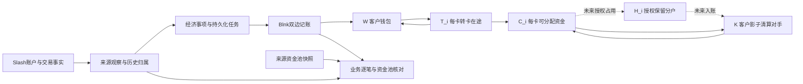
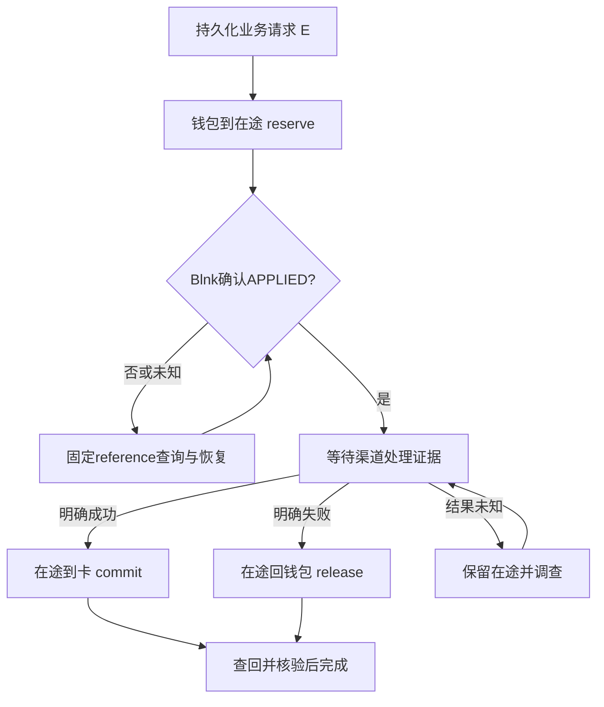
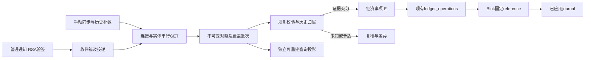

# Slash × Moventra × Blnk 集成调查与实施方案

> 发布补注（2026-09-18）：下文静态调查针对共享工作区 `ce0a88a` 加未提交文件，不是最新远程 main。同步时核实 `78b05aa` 已包含渠道投影、采集器恢复、开户及用户目录；角色/Blnk 迁移正式编号为 004/006。保留原调查证据与哈希，不将旧工作区缺文件判断套用于发布源码；实施方案须先针对最新 main 复核差异。本次仅发布设计，不执行该方案的迁移、真实金融写入或生产账本激活。

核验日期：2026-09-18（Asia/Hong_Kong）。状态：调查及设计，等待实施范围确认。本文新增方案文档，不修改现有业务代码或迁移，不连接生产数据库，不调用租户金融接口，不部署。

**建议先完成“可信来源记录 → 稳定归属及经济事项 → 现有影子记账 → 三层核对”的最小闭环。保留显式转卡在途账户，不在本轮方案中把调额成功定义为资金到账，不切换生产账本。** 钱包、多卡、持久化任务及 Blnk 恢复机制已经存在，优先补适配和证据，而非重建账本。

用户追加的“七、Slash Webhook 与 API 数据持久化”已展开为[持久化专项设计](slash-persistence-design-2026-09-18.md)：包含具体表结构/字段类型、唯一键与索引、历史观察和当前投影、事务性任务与断点、Blnk恢复、存储安全/保留策略及15项故障注入验收。本补充仍仅为设计，不代表相关表或消费者已经实现。

## 1. 核验基线与证据

### 1.1 版本和调查范围

| 对象 | 本次证据 | 结论边界 |
| --- | --- | --- |
| Moventra | HEAD `ce0a88a21b5b6c30a706e601827f45979622e78a`，实际工作区包含大量修改及未跟踪 Blnk 文件 | 下文 LOCAL 指当前文件，不等于该 commit 或线上版本已包含能力 |
| Slash OpenAPI | [官方机器契约](https://api.slash.com/openapi)，OpenAPI `3.1.0`，`info.version=0.0.1`；下载 SHA-256 `70e3dcd7569ec592e285496f5143d53f274ee67be7799fb5043218a3492d04a4` | 版本号不足以定位内容，必须连同摘要；未访问账户、卡片或交易的租户数据 |
| Blnk | 仓库 Compose 固定 `0.15.4`，镜像 digest `sha256:741665b0d7d5a1c6dc0a989aacf249c05637c52dcf96163c67f9d7a7010ec22d` | 本次检查配置，未拉取/启动镜像，不证明部署运行版本 |
| Blnk 官方源码 | [v0.15.4 tag](https://github.com/blnkfinance/blnk/tree/v0.15.4) 经 GitHub API 解析为 `f3067eb56a573055ce86c3328566145b467f393b`，本次下载并检查该 tag 源码 | 在线文档为滚动文档；涉及实现的判断以此固定源码复核，不把新文档功能直接认定适配器已支持 |
| 既有实测 | [2026-09-17 影子验收](../testing/blnk-shadow-2026-09-17.md) | 真实本地 Blnk/PostgreSQL/race 验证是历史证据，本次未重跑数据库集成 |

已阅读根 AGENTS、DEVELOPMENT，Slash/Blnk 接入、领域规则、V1 对账规划、API 契约、金融验收、业务闭环标准，以及 Go、客户端、运营后台和共享包 README。后续实施仍受这些约束。

证据标签：LOCAL=本次源码核查；SOURCE=本次官方资料核验；HISTORY=历史运行记录；DESIGN=内部拟议规则；OPEN=资料不足或本产品未确认。SOURCE 不等于本租户支持。

[机器可读核验清单](slash-blnk-research-2026-09-18.json) 保存本次实际工作区文件摘要、官方OpenAPI/schema摘要、Blnk固定源码摘要及测试边界。公开资料下载缓存位于本机临时调查目录，正式定位依据仍为本文官方URL、commit和内容摘要；这些摘要不声明工作区已提交或服务已部署。

### 1.2 当前实现与目标差异

| 能力 | 当前 LOCAL | 缺口及最小改进 |
| --- | --- | --- |
| Blnk HTTP 边界 | [client.go](../../services/api/internal/blnk/client.go)：`big.Int`、`precise_amount`、显式 precision、5 秒超时、禁跳转、同步 skip_queue；只有 APPLIED 成功 | 继续复用；新增逐笔核对读取包装，不能把 QUEUED/INFLIGHT 当已应用 |
| 丢失响应恢复 | Apply 先按 reference 查询，POST 失败再查；严格核验账户、金额、币种、精度、状态 | 保持此机制；不能把 HTTP 409 或“已存在”无条件视为成功 |
| Blnk 版本兼容 | reference 查询缺 precision 时按 transaction_id 再读 | 本次固定源码确认缺列，保留兼容逻辑；见下节 |
| 账户 | [004 SQL](../../services/api/internal/database/006_blnk_shadow.sql)：wallet/card/transit/clearing；USD scale=2、USDT scale=6；每客户每资产一个 wallet/clearing | 没有平台全局控制账户、连接主档、历史归属有效期或授权分户；新增模型，不修改已应用 004 |
| 持久化处理 | [service.go](../../services/api/internal/ledger/service.go)：Submit/Process/Resolve/Drain；客户 advisory lock + 事项行锁；固定 phase reference；journal/evidence/audit 不可改删 | Drain 为手动 CLI 批次，不是常驻 worker；缺持久化来源收件箱、渠道执行 outbox、未知渠道结果调查队列 |
| 钱包转卡 | W→T 预占；可信 resolve 确认后 T→C，失败 T→W，未知保持 T | 没有 Slash 写适配器；确认仅可信本地输入，不能宣称调额/到账闭环 |
| Slash 标准事实 | [events.go](../../services/api/internal/ledger/events.go)：posted/settled 负 USD→card_settlement；posted/refund 正 USD→card_refund；pending/failed/零不记账 | 不是原始 Slash 解码器/验签器。缺时间、金额历史、原币、费用关系、原退款关联、归属版本；pending/failed 先返回，不检测矛盾组合 |
| 经济去重 | `slash_posting_ + hash(connectionId, transactionId)`；DB 唯一 `(namespace,effect_key)`；同键异金额/主体/账户拒绝 | 已支持跨不同通知证据去重；仍需把来源事实与人工业务操作关联同一键，建立升级兼容别名，避免人工任意键重记 |
| 外部欠额 | card_settlement 允许透支，主动转卡 reserve 禁透支 | 保留事实原则；补负余额、欠额和禁止主动转出的业务告警，而非拒收已发生清算 |
| 查询及第一层核对 | Snapshot 按已应用 journal 重建每个账户，与 Blnk balance 对比；clearing 参与核对但不计客户汇总；超过1000账户报错 | 当前仅余额核对，不是逐笔 Blnk 全量交易比对；非零 inflight debit 一律 mismatch；未核对 inflight credit；需增加逐笔与预占核对及固定批次 |
| 权限 | [ledger.go](../../services/api/internal/api/ledger.go)：客户个人所有权、运营 MFA+ledger_read_grants；强制审计，依赖失败503 | 保持默认拒绝；归属/关系/明细/对账新增权限，不能让读取共享池的权限泄露其他客户 |
| 前端 | [ledgerApi.ts](../../packages/shared/src/auth/ledgerApi.ts)、[ledgerContract.ts](../../packages/shared/src/auth/ledgerContract.ts) 已有精确只读 transport/校验 | 在 apps 中未找到 getShadowLedger 调用；钱包/多卡余额尚未接入正式页面；现有严格枚举需要版本兼容 |
| 渠道投影路由 | 前端 ChannelTransactionsPage 调用 `/admin-api/v1/channel-projections` | 当前 server.go 没有该 handler；database.go 只嵌入001/003/004，当前目录没有002渠道迁移。旧文档“Go 已有投影”与 checkout 不一致；不能当作现成后端复用 |
| 影子边界 | [config.go](../../services/api/internal/ledger/config.go) 只支持隔离本地 shadow；响应 executionEligible=false、authorizationCoverage=not_integrated、externalReconciliation=not_checked | 保留；生产接管不是切环境变量，必须另立迁移切点、唯一写入方与财务验收 |

当前 clearing 是客户维度的影子对手余额，不能直接改名为 Slash 资产账户。所有操作外键都要求同一 customer，正式跨主体/平台控制账需要单独设计边界。

### 1.3 Blnk 0.15.4 复核

- [精度文档](https://docs.blnkfinance.com/transactions/precision)：USD `precision=100`、USDT `1000000`；precision 是倍率，不是小数位数。本项目以整数最小单位发送 JSON numeric `precise_amount`，不是 JSON 字符串，也不使用 float `amount`。
- [固定版本唯一索引](https://github.com/blnkfinance/blnk/blob/f3067eb56a573055ce86c3328566145b467f393b/sql/1770611011.sql)：`transactions.reference` 全局唯一，因此 reference 必须含环境 namespace 的哈希。此保证不替代 Moventra 的经济事项去重。
- [固定版本查询](https://github.com/blnkfinance/blnk/blob/f3067eb56a573055ce86c3328566145b467f393b/database/transaction_queries.go)：GetTransactionByRef 的 SQL 不选择 precision；按 ID 查询选择 precision。适配器现有回读合理。
- [固定版本模型校验](https://github.com/blnkfinance/blnk/blob/f3067eb56a573055ce86c3328566145b467f393b/api/model/model.go)：indicator 限 general_ledger_id。现有确定性 indicator 恢复开户不应直接移植到其他 ledger。
- [Inflight 文档](https://docs.blnkfinance.com/transactions/inflight/creating-inflight) 与 [固定版本实现](https://github.com/blnkfinance/blnk/blob/f3067eb56a573055ce86c3328566145b467f393b/transaction_inflight.go)：支持预占、提交/释放及部分提交。但 [HTTP handler](https://github.com/blnkfinance/blnk/blob/f3067eb56a573055ce86c3328566145b467f393b/api/transactions.go) 默认经队列，`skip_queue=true` 才同步。同步 CommitWorker 调用不带 caller reference 的 CommitInflightTransaction；内部 WithRef 能力不等于公开 HTTP 部分提交可按调用者幂等键安全重试。
- 因此当前方案继续使用普通确定 reference 的显式在途分录。若未来改用 inflight，先对“部分提交响应丢失、重复同额提交、自动过期、worker重启”专门实测，不直接复用现有 Apply 来调用 inflight action。

## 2. 逐字段映射

以下模型名除标注“现有”外均为 DESIGN。`M` 表示本地审计/查询字段；`F` 表示在完整事实及归属成立时可产生分录；`H` 表示候选授权占用，不是已入账收支。Blnk 的实际字段名为 `meta_data`；**现有 Go Transfer 尚无此字段**，首期证据保存在本地，通过 operation/reference 查询，metadata 仅后续增加不敏感的引用。元数据不是授权来源。

所有来源定位统一为 `scope + provider + connectionId + resourceType + externalId`，scope 含环境及法律实体边界；当前尚无平台 tenant，不虚构 tenant_id。connection 轮换密钥不换稳定 ID；更换连接记录需建立同源别名和重放切点，避免同源重复消费。

### 2.1 账户、虚拟账户和卡

依据：[Account](https://docs.slash.com/api-reference/schema-account)、[Virtual Account](https://docs.slash.com/api-reference/schema-virtualAccount)、[Card](https://docs.slash.com/api-reference/schema-card)、[OpenAPI](https://api.slash.com/openapi) 对应 schema 及 GET 路径。

| Slash 接口/字段 | 官方语义 | Moventra 模型 | Blnk对象/参数或metadata | 转换规则 | 缺失/异常处理 | 证据/待核实 |
| --- | --- | --- | --- | --- | --- | --- |
| GET /account[/{accountId}]：id | 来源账户标识 | SourceRef(account)，AccountMapping | M：映射引用，不作为 bln ID | 字符串原样、连接隔离 | 缺ID隔离；不能由名称合并 | SOURCE Account |
| Account.type | debit / charge_card 产品 | sourceProductType | M | 产品决定可比余额口径 | 未知产品禁止自动余额映射 | SOURCE；本租户类型未复查 |
| Account.status/name/createdAt | open/closed、名称、创建时间 | 来源生命周期/展示时间 | M | 名称不是客户身份；关闭保留历史 | 未知状态不激活/删除内部分户 | SOURCE |
| accountNumber/routingNumber | 渠道银行账户资料 | 受控来源字段 | 不传Blnk | 白名单脱敏，独立读取权限 | 不进入普通客户日志/导出 | SOURCE；与PAN不同但仍最小化 |
| Account.balances[] | 可用余额类型名称列表 | 支持余额类型 | M | 列表不是余额金额 | 不以缺失类型补0 | SOURCE |
| GET /virtual-account[/{id}]：virtualAccount.id/accountId | 虚拟账户及所属Slash账户 | SourceRef(virtual_account)，资金池关系 | M：poolMappingRef | 解析响应嵌套 virtualAccount | 不以VA自动创建客户钱包 | SOURCE |
| virtualAccount.accountType | primary / default | poolRole | M | primary代表主账户对应对象；避免与Account再次计资产 | 无法识别共享池时禁止汇总 | SOURCE；产品资金隔离待确认 |
| virtualAccount.name/closedAt | 名称及关闭日期，文档可null | 来源展示/生命周期 | M | nullable兼容；关闭不删除分录 | schema类型与实际null冲突保留质量标记 | SOURCE |
| VirtualAccount.balance.amountCents / spend.amountCents | VA总余额/总消费 | VA观察值及口径 | M，不做余额写入 | 精确整数；单独记录观察时间 | 没有Balance.type/timestamp，不冒充posted或日切快照 | SOURCE；授权/池抵押关系OPEN |
| commissionRule | VA佣金规则 | 规则观察 | M | 规则不等于佣金已入账 | 实际交易和承担方未知则不记账 | SOURCE |
| GET /card[/{cardId}]：id/accountId/virtualAccountId | 卡身份及账户关联 | 现有connection/externalCardID；新增内部cardId、mappingVersion | 现有card balance映射；M：mappingRef | 经服务端归属确认绑定 | 缺VA允许未知；账户或归属冲突复核 | SOURCE；不拿userData作授权 |
| Card.status | active/paused/inactive/closed | sourceCardStatus，与内部风控状态分离 | M | 不改变既有分录；关闭不释放授权 | 状态不明禁止主动操作 | SOURCE |
| cardGroupId/cardProductId/modifiers | 卡组、产品与行为修饰 | 产品能力与限制快照 | M | 卡级和组级限制并列 | 缺字段不表示“无限制” | SOURCE；有效限制叠加规则OPEN |
| last4/name/expiryMonth/expiryYear/isPhysical/isSingleUse/createdAt | 展示及卡属性；单次卡在一次授权尝试后关闭，失败也可关闭 | 脱敏卡查询投影 | M，无分录 | 原样白名单，不增加敏感字段 | 不由关闭推断消费已结清 | SOURCE |
| Card.userData | 可写任意附加数据 | 来源注释 | 不作归属/权限依据 | 内部customerId只取可信映射 | 不信任该字段自动改绑 | SOURCE+DESIGN |
| Card.pan/cvv | include_pan=true 才可能返回 | 本次排除 | 不存储/不传Blnk | GET客户端不请求该选项 | 意外出现需裁剪，不能输出原文 | SOURCE；不扩展既有敏感能力 |

### 2.2 限额及 utilization

依据：[Spending Constraint](https://docs.slash.com/api-reference/schema-spendingConstraint)、[card utilization](https://docs.slash.com/api-reference/card-utilization-get)、[utilization schema](https://docs.slash.com/api-reference/schema-card-group-utilization)、[PATCH](https://docs.slash.com/api-reference/card-spending-constraint-patch)。

| Slash 接口/字段 | 官方语义 | Moventra 模型 | Blnk | 转换规则 | 缺失/异常处理 | 证据/待核实 |
| --- | --- | --- | --- | --- | --- | --- |
| Card.spendingConstraint.spendingRule.utilizationLimit.limitAmount.amountCents | 周期消费上限 | LimitPolicy.limitMinor | M，不记资金 | 精确整数；保留完整规则版本 | 无规则为unknown/not_applicable，非0余额 | SOURCE；产品币种上下文需确认 |
| utilizationLimit.preset | daily/weekly/monthly/yearly/collective | limitPeriod | M | 与资金分户余额分离 | 新枚举不套默认周期 | SOURCE |
| utilizationLimit.timezone | IANA时区，未设用UTC | limitTimezone及来源是否缺省 | M | 使用时区数据库，不能仅固定UTC偏移 | 非法拒绝；不得用财务日切覆盖 | SOURCE |
| utilizationLimit.startDate | 可选过去/当天；daily忽略，其他指定周期用于计算起点 | sourceStartDate | M | 保存原值及解析结果 | collective细节不靠推测补周期 | SOURCE/OPEN |
| spendingRule.transactionSizeLimit.minimum/maximum.amountCents | 单笔大小约束 | transactionSizePolicy | M | 缺省与0明确区分 | 非法范围复核，不影响余额 | SOURCE |
| merchantCategoryRule/merchantRule/countryRule/merchantCategoryCodeRule | allowlist/blocklist及对象列表 | eligibilityPolicy | M | 完整保留对应限制，不因调额丢失 | 冲突或未知枚举复核 | SOURCE |
| GET /card/{id}/utilization：spend.amountCents | 当前周期消费额 | LimitObservation.spendMinor | M | 不累计为已入账消费 | 授权、退款、费用计入口径需实证 | SOURCE；不是posted余额 |
| 同上 availableBalance.amountCents | 当前周期剩余额度，仅存在spend limit时返回 | limitRemainingMinor | M | 命名为“剩余额度”，不映射ledgerAvailableMinor | 缺失不是0或无限可用 | SOURCE |
| 同上 nextResetDate | 下次重置；collective不返回 | nextLimitResetAt | M | 只描述额度周期 | 缺省不生成过期释放任务 | SOURCE |
| GET /card-group/{id}/utilization | 卡组当前utilization，结构同上 | groupLimitObservation | M | 与卡限额并列约束，不能逐卡复制为余额 | 组其他卡消费影响未覆盖则不认证额度一致 | SOURCE/OPEN |
| PATCH/PUT /card/{id}/spending-constraint | PATCH保留未传属性，null删除；PUT替换 | ProviderLimitOperation：期望/读前/读后规则摘要 | 无直接资金分录 | 调额状态与内部转卡状态分开 | OpenAPI未声明幂等键/CAS；超时不增量再加 | SOURCE；生效原子性OPEN |

### 2.3 交易、费用、返现和关系

依据：[Transaction](https://docs.slash.com/api-reference/schema-transaction)、[交易详情](https://docs.slash.com/api-reference/transaction-get-by-id)、[fee-details](https://docs.slash.com/api-reference/transaction-get-fee-details)；字段结构按本次固定 OpenAPI 的 Transaction、OriginalCurrency、TransactionFxFeeInfo、TransactionCashbackInfo、FeeTransaction 核查。

| Slash 接口/字段 | 官方语义 | Moventra 模型 | Blnk对象/参数或metadata | 转换规则 | 缺失/异常处理 | 证据/待核实 |
| --- | --- | --- | --- | --- | --- | --- |
| GET /transaction[/{transactionId}]：id | 来源交易身份 | SourceRef(transaction)、现有TransactionID | effectKey派生reference，不裸用id | 相同事项跨观察复用键 | 缺id不能自动记账 | SOURCE+LOCAL |
| accountId/virtualAccountId/cardId | 来源资源关系；非卡交易可无cardId，accountId schema为any | sourceAccountRefs、历史归属映射 | 选择已授权source/destination | accountId只接受核验过的表达，不强制内部UUID | 类型变化或跨连接关系隔离 | SOURCE |
| accountSubtype | charge_card区分cash/credit；debit交易仍为cash | sourceAccountSubtype、poolMapping | M/控制账户选择证据 | debit产品cash交易映射debit余额需显式规则 | 不直接拿它等于Balance.type | SOURCE |
| status + detailedStatus | 粗状态和细状态组合 | source原值+独立authorization/posting/refund/dispute | 仅合格F进入Apply；详见组合表 | 先校验组合及已应用历史 | 矛盾/新枚举进入持久化review | SOURCE+DESIGN |
| amountCents | USD cents，负借记正贷记 | accountAmount{signedAmountMinor,USD,2}；现有SignedAmountMinor | F：abs值→precise_amount；currency=USD、precision=100 | 原始JSON数字词法精确解析；禁止float64中转 | 分数最小单位、溢出、缺失隔离；0保留但不POST | SOURCE+LOCAL |
| originalCurrency.code | 原币，整个对象省略时原币USD | originalCurrency + defaultBasis | M | 仅Slash适用默认；不补金额/汇率 | 非法/未知币种保留待核实 | SOURCE |
| originalCurrency.amountCents | 原币cents | originalAmount及rawUnit | M，不再扣原币钱包 | 非2位币种先核编码；不得机械按ISO重解释 | 编码不明只展示原始单位，禁汇总/折算 | SOURCE/OPEN |
| originalCurrency.conversionRate | 原币转换到账户币的来源汇率 | providerFx.rate十进制字符串、方向、观察引用 | M | 不反推授权/清算价差收益，不重算扣款 | 缺失为unknown，不补1 | SOURCE |
| authorizedAt | 卡授权UTC时间 | authorizedAt | M | 与GET观察时间、入账时间分开 | 缺失不从date反填 | SOURCE |
| date | posted时为入账UTC；pending/failed时为创建时间 | sourceDate；仅posted派生postedAt | M：业务日期；Blnk执行时间另存 | 保存每次观察，日期可变化 | 迟到按政策重述报告，不改旧journal.created_at | SOURCE |
| 无对应字段：observedAt/receivedAt/mappingVersion | 内部观察、接收及映射版本 | SourceObservation / MappingRun | M：observationRef | 内部明确标记，不宣称Slash更新时间/版本 | 不按通知时间给GET定版本 | DESIGN；无通用updatedAt/version |
| providerAuthorizationId | 卡授权提供方标识 | AuthorizationRelation候选；按连接/账户范围隔离 | H关联，不作最终posting唯一键 | 与授权Webhook data.transaction.id对应 | 不证明一次授权只有一次入账 | SOURCE；多次清算OPEN |
| orderId/referenceNumber | 商户订单号、Visa参考号 | 候选关系及审计 | M | 可辅助调查，不作全局唯一ID | 多候选保留unmatched | SOURCE |
| merchantData/description/memo/declineReason/approvalReason | 商户、描述、备注和原因 | 裁剪查询字段 | M，必要时仅证据ref | merchantData优先于deprecated merchantDescription | 不以文本猜退款、费用或客户归属 | SOURCE |
| fxFeeInfo.amountCents | 已创建FX费的USD分说明 | FeeAnnotation | M，不独立记账 | 与实际费用流水建立关系 | 不能从注释再扣一次；缺失不证明无费 | SOURCE |
| feeInfo.relatedTransaction.id | 费用关联交易ID | confirmed-source fee relation（需验证两端范围） | M | 费用交易自身F仅一次；关系用于分配 | 目标未采集则待关联 | SOURCE |
| feeInfo.relatedTransaction.amount | 关联金额，未明确单位 | rawFeeRelationAmount | M，不用于计算 | 保存词法值，禁止当cents | 待渠道确认 | OPEN |
| fee-details items[].id/dateCharged/feeAmountCents/feeType/accountId | 费用交易拆分明细 | FeeBreakdown及日期/类型 | M；不默认每个item独立F | 端点用于费用交易，不保证消费ID可查询全部费 | 顶层费用与拆分金额/范围不一致入差异 | SOURCE |
| fee-details items[].originalTransaction/card | 明细对应原交易/卡，均可选 | 有证据的费用分配关系 | M：allocationRef | 校验连接、账户、历史归属；各份合计=费用事实 | 未分配部分留控制/待认领，不猜客户 | SOURCE+DESIGN |
| cashbackInfo.amountCents/rate | 已知可赚返现金额及率 | CashbackAnnotation/预计权益 | M，不增加可用 | 等独立实际入账/结算证据 | rate倍率、入账方式及冲回规则OPEN | SOURCE/OPEN |
| 通用 refund-parent / captureId / expiry 字段 | 当前Transaction无这些通用字段 | Relation/HoldEvidence可空 | 不凭空构造Blnk父关系 | 只能由补充可信证据关联 | 未匹配退款不标全退；expiry不靠固定天数 | 本次schema检索/OPEN |

金额接口虽然有部分 `number` 定义，领域要求仍按已确认的最小单位整数处理。来源如出现合法JSON指数，可在来源层用精确十进制规范化并记录原文；不能经浮点舍入。内部 Command 继续只收规范整数字符串，不改变现有拒绝指数规则。

**组合状态策略**（卡事实还必须有币种、签名/可信获取、客户归属和来源范围）：

| 来源组合/金额 | 处理 |
| --- | --- |
| posted + settled + 负值 | 现有候选消费出账；新增资源分类/费用识别，不能把所有账户借记当卡消费 |
| posted + refund + 正值 | 退款入账候选；原消费关联与账户入账分开；缺历史归属则先复核 |
| pending + pending | 仅授权观察；有明确卡授权证据才走H，不产生消费支出 |
| pending + pending_approval | 审批等待，不据此预占资金 |
| failed + declined/canceled/failed/reversed | 不产生新支出；若已存在占用，只在确认对应授权已不影响余额时释放 |
| posted + dispute | 保留已入账影响，更新争议维度；新快照不当作贷记/扣回 |
| posted + returned、posted正settled、其他组合 | 分产品适配/人工复核；ACH returned不是卡退款通用规则 |
| 已应用后看到pending/failed、同ID金额变化 | 不撤销历史账；新观察标冲突，重拉/复核，有更正证据才追加分录 |
| 0、未知/矛盾组合 | 0保留来源不发零额Blnk交易；矛盾组合即使无资金影响也记录质量异常 |

### 2.4 余额、通知和执行证据

| Slash 接口/字段 | 官方语义 | Moventra模型 | Blnk | 转换规则 | 缺失/异常处理 | 证据/待核实 |
| --- | --- | --- | --- | --- | --- | --- |
| GET /account/{id}/balance：accountId/type | 余额所属账户；cash/credit/debit | BalanceSnapshot范围 | M/核对输入，不能set balance | 每连接/账户/币种/类型单独保存 | 未确认币种不入金额核对 | [Balance](https://docs.slash.com/api-reference/schema-balance) |
| available.amountCents | 当前可用；cash为超额非抵押现金，credit为卡可消费额度，debit可消费/提取 | channelAvailable | M | 与内部available分开 | 不无条件cash+credit，亦不posted-available推冻结 | 同上 |
| posted.amountCents | 排除pending的已入账余额 | channelPosted | M | 产品验证后才可用期初+流水公式 | 信用/抵押机制未明则数据不足 | 同上 |
| timestamp | 来源计算余额的UTC时点 | sourceComputedAt | M | collectedAt另存 | 过期显示stale；不是日终证明 | 同上 |
| Money缺currency | 只有amountCents | currencyBasis/sourceProductVersion | M | 依据已验证产品解析 | 不因交易为USD就无证据补所有余额USD | OpenAPI Money |
| 普通Webhook eventId/entityId/event/eventTimestamp | 变化通知元数据，不含实体快照 | SourceEvent、Delivery、SourceRef | M；eventId不是reference | 连接+事件ID去重；实体重新GET | 乱序/重复正常；未知事件隔离 | [事件](https://docs.slash.com/api-reference/schema-webhook-event) |
| slash-webhook-signature | 原始字节RSA/SHA256签名 | 验签结果/密钥版本/原文摘要 | 无资金动作 | 验签后持久化收件箱再2xx | 伪造拒绝；存储失败不先应答 | [普通通知](https://docs.slash.com/api-reference/webhook-overview) |
| aggregated_transaction.create/update | 交易变化通知 | 拉取transaction任务 | M→合格F | 仅触发重新读取，不按事件名扣款 | 事件时间不代表GET快照版本 | OpenAPI WebhookEvent |
| authorization.request：event.id、data.transaction.id/card.id/account.id/virtualAccount.id、amount.amountCents、currencyConversion | 实时授权请求；transaction.id对应providerAuthorizationId | 单独AuthDecision及HoldEvidence | 未来H，批准不代表posted | 与普通通知分入口/验签/响应时限 | 本产品未开通不启用；金额编码待实证 | [授权事件](https://docs.slash.com/api-reference/schema-authorization-request-event) |
| 授权x-webhook-id/timestamp/signature | HMAC-SHA256签名与重放时限 | 授权请求验签/去重 | 无直接posted | 原始请求体+ID+时间；常量时间比较 | 与RSA入口不可混用 | [授权概览](https://docs.slash.com/api-reference/authorization-webhook-overview) |
| POST /transfer/virtual-account：source/destination/amountCents，X-Idempotency-Key，transferId | VA间或主账户向VA的划转 | ProviderTransferAttempt及来源身份 | 未来内部划拨确认证据 | 稳定请求键及规范请求摘要 | 保留期、状态查询和交易关联方式待确认 | [VA划转](https://docs.slash.com/api-reference/transfer-virtual-account-post) |
| POST /transfers/book-transfer：from/to/amountCents，X-Idempotency-Key，transferId | 可访问Slash账户间即时账内划转；同键异body为409 | 同上 | 未来独立执行路径 | from/to是账户ID，不是cardId；核法律实体范围 | 不虚构GET /transfer/{id}；恢复查询路径须确认 | [Book transfer](https://docs.slash.com/api-reference/book-transfer-post) |

普通通知重试/乱序、持久化处理和补同步见第5节。`payments.refund.*` 属 Payments 的退款事件，不能直接当作发卡消费退款；发卡事实以 transaction 拉取及对应产品证据为准。

## 3. 钱包、多卡及执行约束

### 3.1 三方职责和账户结构

Slash 提供渠道账户、卡、限额、交易和余额事实，以及其产品允许的调额、账户划转、实时授权接口；是否允许本客户使用由租户权限和产品决定。Moventra 负责客户主体、历史归属、资金政策、业务请求、审批、来源证据、经济去重、执行恢复、对账与权限。Blnk 负责余额、同资产双边交易及自己的交易状态；它不能判断某个 Slash 退款应属于哪位客户，也不能替代渠道的批准结果。

W/C/T/K 已有；H 为未来可选扩展。当前 K 并非渠道资金池。一个客户可以有多张 C_i/T_i；共享渠道池按连接/账户/余额类型只记录一次，不复制给每张卡。

本轮推荐继续显式 T。若以后采用显式 H，则 `卡账面权益=C_i+H_i`，`卡内部可用=C_i-其他明确限制`，客户账面合计 `W+ΣC_i+ΣT_i+ΣH_i`。此时不得再从 C_i 扣一遍 H_i。若采用 Blnk inflight，则卡posted仍为C，available=C-inflightDebit，客户合计不另加hold。**同一占用只允许选择一种表达。** 当前只有T，所以现有合计W+ΣC+ΣT正确；增加H需要新契约，不能直接塞进当前前端kind枚举。

正式财务层候选：客户负债分户W/C/T/H、渠道托管资产、结算应付/应收、平台费用/收入、未认领款；按资产和法律实体分账。Blnk余额“source减少、destination增加”是引擎方向，不意味着所有科目都有同一会计借贷正常方向。建议显式配置 normalSide 和金融报表映射，经财务确认：例如客户钱包→卡为借客户钱包负债、贷客户卡负债；卡消费为借客户卡负债、贷渠道结算应付；实际清算再借结算应付、贷托管资产。若渠道入账已等于资产直接减少，则采用经确认的直接结算政策，不能两条路径重复减少资产。

当前客户级 K 保持影子用途，不新增第二套账再重复扣客户。未来平台总账控制数可由明细汇总核验；控制汇总行不加到客户资产上。平台自有钱、客户负债、信用额度、托管位置分别报告。

### 3.2 五种金额不能混同

| 名称 | 依据 | 使用边界 |
| --- | --- | --- |
| 渠道余额 | Slash指定账户/类型/时点 | 描述渠道资金或消费能力，可能多人共享 |
| 内部账面余额 | 期初凭证+已应用分录 | 描述客户权益分配；含已纳入口径的在途 |
| 内部可用余额 | 内部账面扣已证实占用及政策限制 | 未完整接入授权时只是影子值；负余额必须可见 |
| 卡限额/周期剩余额度 | spendingConstraint和utilization | 消费规则；重置/退款可能改变剩余额度，不是资金充值 |
| 真实可消费额度 | 渠道在实际授权时综合余额、卡/卡组、商户/国家、风控及授权决策 | 当前未知；不能仅min(影子余额,某限额)后向客户保证可刷 |

### 3.3 限额能否约束内部分户

**目前不足以保证。** 以下只是需验证的产品模型：若同周期支用U与内部目标可消费R完全可比，可候选设置总限额L=U+R；不能直接L=卡余额。例如U=80、R=220，候选L=300。但只有确认U是否含pending、退款/撤销何时恢复、费用是否占限额、卡组叠加、周期重置、离线/迟到提交及调额生效竞态后，公式才可进入执行设计。GET utilization没有来源快照时间字段，不能假设与调额读前/读后原子一致。周期重置可能在内部资金不增加时恢复渠道额度，必须专门测试。collective也不能凭名字推断完整生命周期。

调额最少需要持久化读前规则、期望绝对值、操作ID、规则摘要、读后确认、操作者和来源证据；按卡串行，保留其他限制。外部控制台同时调额仍可能竞争，读回相等只能证明观察时的配置，不证明本次命令独占生效。`PATCH`没有本次可见的CAS/幂等头，不设计“超时后再加300”的重试。

替代方案按证据强度选择：

1. **首期：只读影子分户及差异告警。** 用户界面标为内部资金分配，真实消费由现有权威系统约束，不开放卡转钱包兑现。
2. **独立VA资金隔离候选。** 官方允许VA/账户划转，但需确认卡是否只能消费该VA、是否存在主池/信用兜底、授权占用下可转出金额、手续费及两端事实关联。账户划转接口不等于逐卡划转接口；不在本次自动创建VA。
3. **实时授权候选。** Slash企业授权Webhook默认1.5秒；若要求内部额度硬约束，候选fallback=reject，不能用default旁路内部余额。当前5秒Blnk HTTP及持锁网络流程不适合直接放入该时限。需独立低延迟持久化预占、响应丢失与迟到确认恢复、压力/故障测试；还须确认并非所有最终清算都可被授权入口控制。[官方授权说明](https://docs.slash.com/api-reference/authorization-webhook-overview)

即使未来调额能约束消费，W→C仍是内部权益重新分配，不是外部充值；界面可显示“内部分配完成/渠道额度已核对”，不能显示“资金已到账Slash”。真实账户划转必须另存transferId及实际转账证据。

### 3.4 显式在途与 Blnk inflight 的取舍

| 比较 | 显式T/H账户 | Blnk inflight |
| --- | --- | --- |
| 转卡未知结果 | T保持余额，不自动释放；已实现 | 自动expiry若配置不当可在渠道结果未知时放钱 |
| 确认及重试 | 每phase固定reference，现有Apply可恢复 | action/部分commit重试要专门确认HTTP语义，不能仅依赖原交易reference |
| 客户总额 | 必须把T/H作为权益组成、各计一次 | 原卡posted保留，hold不另计资产 |
| 授权清算 | H是内部重分类；多phase需业务级锁和恢复 | 原生预占/提交更自然，但需要适配、worker、核对与运营能力 |
| 当前兼容 | T已实现；H需新增kind、状态和返回协议 | 当前Snapshot把非零inflight判mismatch，直接启用会破坏现有断言 |

选择：先保留T；授权先做观察及覆盖，H或inflight待产品事实和恢复协议完成后再批准。若未来用H，明确卡权益=C+H；清算多phase之间阻止主动转出，避免暂时多放可用。不要同时W→T又对W建inflight，造成双重预占。

## 4. 逐场景流程、分录与恢复

以下为 DESIGN，除注明现有的路径外均未接入。所有“自动”先指获准后的隔离shadow消费者；生产仍禁用。`X→Y:n` 表示Blnk source=X、destination=Y、`precise_amount=n`（USD分），source减n、destination加n；所有例子合成，不代表渠道实际收费或生命周期。K为现有影子对手，正式控制科目另审。

通用键：`E`=稳定经济事项键；`R(E,phase)=mv_+sha256(JSON([namespace,E,phase]))`，这是当前实现。下表写E后，所有Blnk阶段均使用R；同E异payload必须拒绝/复核。

| 场景 | 触发事实 → 来源证据 | 内部状态 | Blnk动作/方向 → 余额影响 | 幂等键 | 失败恢复 | 对账/验收 |
| --- | --- | --- | --- | --- | --- | --- |
| S01 钱包转卡预占（已有） | 经批准内部请求；钱包/卡/在途同主体同币种 | pending→awaiting_provider | W→T:30000；W-300、T+300，总额不变，可用-300 | 请求稳定E，reserve | Blnk未知保持pending，先查R；不调用渠道直到预占确认 | R01/R11；无预占成功不能确认渠道结果 |
| S02 渠道处理/成功 | 调额配置确认，或真实账户划转证据，两者区分；当前仅可信resolve | awaiting/provider_unknown→commit_pending→applied | T→C:30000；总额不变 | 同E，commit；另有providerAttempt键 | 调额成功不能自动证明到账；缺匹配确认留未知 | 查期望规则/transfer事实、T清零、只有一commit |
| S03 明确失败 | 可信未执行/最终失败证据，不以普通超时/5xx推失败 | release_pending→released | T→W:30000；恢复可用，总额不变 | 同E，release | 若reserve自身余额不足为rejected，无T需释放；commit后不得再release | R11；确认成功与失败竞争只允许一个终态 |
| S04 结果未知 | 超时、响应丢失、执行状态不可查 | provider_unknown | 无新分录，T仍300 | 同E/providerAttempt | 查配置及执行记录；不得新键重发/超时自动释放；长龄人工调查 | 在途账龄及证据，重复恢复总额恒定 |
| S05 卡转钱包（未支持） | 产品允许资金转出；已确认授权/未结义务与限制，渠道收紧或VA转账确认 | proposed→reserved→provider_unknown/confirmed | 候选C→独立转出T→W；失败T→C；总额不变 | 独立请求E及reserve/commit/release | 先阻止新消费、核既有授权，未知留T；当前禁此操作 | 不得以L-U可提现；未核实渠道能力阻塞启用 |
| S06 消费授权 | GET pending/pending，明确卡授权关联；实时请求另行审批 | authorization_observed；未来held | 当前无分录；未来C→H:10000，总权益不变、可用-100 | scoped授权ID及已确认hold动作E，不用eventId | 重复/重拉只更新观察；金额增减需证据，不能按latest盲放 | F01/F05；首次只见posted不伪造历史授权 |
| S07 撤销/拒绝/过期 | 可信对应授权解除；来源failed等与既有hold核验 | released/declined/expired | 若H存在H→C:剩余；无H不做退款 | 授权解除动作E | 不按固定天数本地自动释放；状态矛盾留复核 | F04；支出0、释放非收入；未获expiry证据不得标expired |
| S08 最终入账及金额变化 | posted/settled负额；同一事项最终101、原授权100 | posted；授权按证据结清 | 当前C→K:10100一次；未来H→K:10000、C→K:100；若最终80，则H→K:8000、H→C:2000，仅有全解除证据时 | 入账E；多个phase稳定 | 有posted无解除证据先保守保留剩余hold并标疑似重复占用，等待核验；不推FX损益 | F01–03；净支出仅最终金额，不为201 |
| S09 部分/多次入账 | 需明确每次独立入账ID或可证明累计语义及capture关系 | partially_posted / posted | 合成60+40，各C/H→K，合计100 | 各capture经济ID；若同ID累计变化，首期复核 | Slash表达未核实，不从60→100自动再扣100，也不单凭快照差算40 | F06；拿到真实生命周期证据后才开自动路径 |
| S10 迟到入账 | 旧授权已释放后取得新的posted负额 | posted，附late标记 | C→K:10000；允许事实导致负C，新增风险异常 | 稳定入账E | 不能按旧状态“已过期”丢弃；缺授权不阻塞可信入账 | F07；重述受影响批次，不重写原分录 |
| S11 部分/多次退款 | 每笔posted/refund正额；确认卡与历史归属 | refund_posted；关系单独partial/full/unknown | K→原权益分户:2000，再3000；原100支出保留，净支出50 | 各退款来源交易E | 重放不重复贷记；退款失败/申请无贷记；原币比例不推USD金额 | F09–11/F14；跨月按实际退款日期 |
| S12 未匹配退款 | posted/refund正额，但原消费缺失 | posted+relation_unmatched，或ownership_review | 卡/历史归属确定可K→对应C；归属不明仅保存来源，待认领控制流程，不给当前用户 | 退款E保持不变 | 后续匹配只补关系不再贷记；待认领转归属须关联原资金影响 | F26/R09；不能按商户同额自动归原单 |
| S13 独立费用与注释 | 顶层费用posted事实；fee-details/fxFeeInfo仅说明；承担方政策已确认 | fee_posted / fee_allocation_review | 客户承担时C→K:101；平台承担走平台费用账，不扣客户；注释无动作 | 顶层费用经济E，各分配phase且合计固定 | 无客户归属不随意扣卡；已作为settlement记过的同笔费用只改分类 | F13/F17；100笔重复注释仍只扣1.01 |
| S14 返现 | cashbackInfo仅信息；需独立入账/实际结算证据 | earned_unposted / cashback_posted | 信息无动作；核实实际入账后K→C/W:200；冲回反向50 | 每笔实际返现/冲回E，关联原项 | 当前正settled被ErrUnmapped；扩展前确认币种、政策及来源交易分类 | F13/R12；未来净返现1.50，不提前抵消费 |
| S15 争议 | dispute状态、案件证据；临时贷记/扣回必须另有资金事实 | dispute_open，与posting分离 | 状态本身无动作；有证据临时贷记K→C、扣回C→K | 各资金事项E，案件ID只关联 | 不因won自动发款，不因dispute删除原消费 | F12；原100+贷100-扣100仍净支出100；渠道表达OPEN |
| S16 重复/乱序/漏事件 | 签名通知及GET观察、补同步批次 | received→persisted→mapped/applied/review | 只有新经济影响执行一次 | eventKey去投递重复；E去经济重复 | 来源串行拉取；新观察不证明业务更新；失败补拉/历史扫描 | F20–24；10次通知、10次同步只有一次影响 |
| S17 Blnk未知/重启/并发 | 已持久化operation，HTTP失败或本地提交失败 | 原状态+lastError；不标成功 | 按R读回APPLIED且payload一致后补journal；未知不重置资金 | 固定E+phase，现有实现 | 重启Drain；客户锁/行锁；远端成功本地回滚恢复同R；冲突review | R04/R10；余额与journal先mismatch再恢复，不补造调整 |
| S18 已入账更正 | 来源更正证据/人工复核，100改90，不是普通乱序 | correction_approved→applied | 保留C→K:10000，追加K→C:1000；或完整冲正再记90，二选一 | correctionId+原E，稳定审批payload | 原E异额仍冲突；单独更正事项，不以mappingVersion重新记90 | F25；累计净支出90，不是190 |

S08未来显式H的多phase必须在客户级业务锁及持久化settlement-plan下执行；任一步未知时，该卡主动资金操作阻塞。只有已完成的phase进journal，核对显示处理中，不能向外宣称整个事项已完成。若不具备可靠capture/释放证据，首期继续只做已确认posted记账，授权保留为观察，`authorizationCoverage=not_integrated`不变。

### 4.1 关键恢复流程

这里渠道处理证据必须标明 `limit_configuration` 或 `account_transfer`；当前Resolve没有这种证据强类型，只验证非空字符串，扩展时需拒绝由错误证据类型跨阶段确认。

### 4.2 数值例子与分录方向

合成USD期初1000，已确认入账凭证K→W:100000；钱包转卡300，授权100，实际入账101，独立费用1.01，退款49.80。

| 步骤 | Blnk分录（分） | W | T | C | H（未来） | 客户账面合计 |
| --- | --- | ---: | ---: | ---: | ---: | ---: |
| 期初 | K→W 100000 | 1000 | 0 | 0 | 0 | 1000 |
| 转卡预占 | W→T 30000 | 700 | 300 | 0 | 0 | 1000 |
| 转卡确认 | T→C 30000 | 700 | 0 | 300 | 0 | 1000 |
| 授权 | 候选C→H 10000 | 700 | 0 | 200 | 100 | 1000 |
| 实际101并确认解除 | H→K 10000；C→K 100 | 700 | 0 | 199 | 0 | 899 |
| 实际费用1.01 | C→K 101 | 700 | 0 | 197.99 | 0 | 897.99 |
| 实际退款49.80 | K→C 4980 | 700 | 0 | 247.79 | 0 | 947.79 |

当前未启用H时，授权行只存观察、C仍300，入账时C→K:10100；最终数值相同。差额101-100不定义为汇兑损益。原币CNY720及退款CNY360单独分析，净原币360，USD净支出`10100+101-4980=5221`分，不追加CNY分录。所有来源费用注释均不增加这5221。

负余额例：卡C=10，后来已确认消费15，C→K:1500后C=-5，保留真实事实并告警；不得填造充值5。此时客户主动卡转钱包或新的自主支出不能放行。收到可信退款2后C=-3，仍如实展示。

两卡例：初始W=1000，向A分300、向B分200，完成后W=500、A=300、B=200，合计1000；任何共享Slash池余额都不再加入客户合计。

## 5. 一致性、时间与去重设计

### 5.1 来源层和业务层分开持久化

来源收件箱与账务提交采用同库事务/outbox：先保存观察、归属版本和唯一economic effect，再创建现有operation；失败可重试，不能出现“已推进同步游标但经济事项未持久化”。公共原始Webhook不直接构造可信CardPosting。只读GET查询永不触发记账或渠道写入。

普通通知在10秒内持久化后应答；官方说明最多12次退避重试、连续6次永久失败后停用，停用/退避期间事件排队。仍需补同步与覆盖检查，不能把通知队列承诺当全历史完整性证明；入口重新启用是写配置，需要后续授权。[普通通知规则](https://docs.slash.com/api-reference/webhook-overview)

目前沿用手动同步策略；实现补同步应先做显式手动任务和断点，不擅自恢复历史5分钟轮询。未来常驻worker与定时补数需独立范围确认。

### 5.2 四层身份及兼容

| 层 | 身份及用途 | 不应包含 |
| --- | --- | --- |
| 投递 | deliveryId，每次接收另记；eventKey=(scope,connection,eventId) | 不用它作为资金唯一键 |
| 来源资源/观察 | resourceKey=(scope,provider,connection,resourceType,externalId)；observationId+内容摘要 | 不把观察序号/内容哈希伪装为来源版本 |
| 经济事项 | E=规范来源资金事项或内部请求ID；保存provider_transaction_ref、kind、确定归属及不可变金额 | eventId、mappingVersion、重试次数、观察时间、金额变化均不自动产生新E |
| Blnk动作 | R(E,phase)，一个事项可reserve/commit/release等多个不同动作 | 不裸用transactionId跨连接/环境 |

当前`slash_posting_hash(connection,transaction)`在单一Slash交易资源上下文已经隔离；不要为了升级字段而直接改键算法。新增EffectRegistry保留`legacyEffectKey`及旧reference，回填从现有operations/journal匹配；先查旧映射再创建新规范键。已记账交易从消费改成费用仅更新分析分类及费用关系，不新增经济影响。无E关联的人工入账以后必须先登记来源经济事项，不能任意造effectKey后再让同步重复记账。

来源同ID出现不同金额不把“新哈希”当新交易。先确认是累计清算、纠正、旧快照或数据问题，再走批准的关联更正。不同ID也不一定不同经济事项，例如内部划转的双端记录，应通过可靠transfer关联对应一个内部划拨；关联不明时隔离，不以同额同时间自动合并。

### 5.3 观察顺序、历史归属与权限

- OpenAPI未提供通用Transaction updatedAt/version或updated_since；GET列表有cursor、date/authorized_at区间、账户/卡等过滤。远端from/to描述为包含边界，内部使用半开区间；拉取后精确本地裁剪，不能把to原样当排他边界。
- date会因posted改变。未完成对象重拉、重叠窗口、旧历史分段回扫、通知漏单检查结合；遍历完cursor不等于得到原子全量快照。保存每页范围、cursor、请求过滤器、失败/限流、观察区间及完整性依据。
- 同实体串行/合并拉取防止本地并发响应覆盖；这不保证上游无缓存或业务倒序。已记账事实不可由较晚GET中的pending/failed自动逆转。
- 归属表保存有效期、内部cardId、customerId、连接/账户/卡、证据和审批；每个经济事项固定bindingVersion。当前卡与在途分别有唯一约束但不是同一历史身份表，Provision还应核查两者同主；不能仅依赖每种kind的唯一索引。
- 首期维持禁止带余额/占用卡改绑。未来退款优先原经济事项归属；原单缺失且改绑区间跨越时进ownership_review，不能直接贷给当前持卡人。换客户ID、连接ID、父子路径、关系详情、导出与缓存都服务端复验。

### 5.4 精度、记账日期及不可变性

本地`numeric(38,0)`/big.Int、前端BigInt或十进制库；禁止Number汇总。USD scale2=precision100，USDT scale6=precision1000000；原币单位另有版本化映射，禁止跨资产相加。Blnk返回的浮点amount不作为核对依据，只核precise_amount/precision/currency。

每笔保留sourceDate、authorizedAt、postedAt、observedAt、内部receivedAt、accountingAppliedAt；业务时间和本地journal记录时间分开。首期不回写Blnk过去created_at；如后续使用effective_date，先补契约、能力及关账政策，不能把观察日期当渠道入账日期。

journal/evidence/audit继续append-only；更正通过新事项关联originalEffect/originalJournal/correctionReason/approval。`review_required`需要明确受控恢复接口，不能手工UPDATE回pending掩盖冲突。即便恢复成功也保留此前未知、失败、差异和复核记录。

## 6. 三层对账及验收

### 6.1 固定核对批次

沿用既有V1规划，新增持久化ReconciliationRun，而非重新设计页面口径。每批固定scope、连接/账户/余额类型/资产、from/to、日切时区、期初凭证、ledger截点、source观察集合、mappingVersion、ruleVersion及coverage。作业状态、核对结论、差异处理状态独立保存。

| 层 | 检查及公式 | 当前差距 | 数据不足与差异处理 |
| --- | --- | --- | --- |
| L1 Blnk ↔ 本地已应用分录 | 每张journal按reference及ID读Blnk，核source/destination/precise_amount/precision/currency/APPLIED；账户期末=期初+入-出；反向检查Blnk受控范围内有无孤立交易/余额 | 当前Snapshot只比余额；可能漏掉相互抵销的错记。增加交易明细和账户全集覆盖，并核inflight debit/credit及已知holds | 远端成功本地未落journal标recoverable_pending，恢复同R；不可伪造调整。非法直接写Blnk单列异常，不用余额相同判通过 |
| L2 业务事项 ↔ Slash逐笔事实 | 以SourceRef/E进行身份、金额、状态、归属、关系、资金影响次数核对；退款/费用分配与业务请求分别核 | 当前无真实来源观察库和批次，也无完整人工账关联 | 断定缺单需覆盖依据；缺来源、缺内部、异额、未匹配、重复、归属不明分开。审批成功不等于有posted |
| L3 内部控制 ↔ Slash可比池 | 对明确可比资产/负债/额度角色分别核：可比应有=内部对应控制值+有证据的有符号桥接项；差异=来源实际-可比应有 | 当前客户clearing无pool/类型维度，不具备直接外部池核对能力。先建立控制映射和期初，不直接Σ客户=available | 缺期初、币种、产品公式、全量非卡流水、日切桥接时返回insufficient_data；不得造“其他调整”配平 |

客户资金可能还有其他托管位置；池可能含平台钱、抵押、结算应收应付。cash/credit/debit分别核，不把credit可消费额度当现金资产。只有经产品验证的posted现金流口径可使用“来源期初+全期间有符号posted流=期末”；available与posted的差不自动全部归授权占用。

L1已有零余额开户；期初必须是可信有对手分录，不修改balance。对未来迁移，应固定切点T0和已记经济事项集合：T0前纳入期初的历史交易只补展示/证据，不再扣款；T0后的事件按经济去重处理。不能只按date切割，因为迟到、更正和date变化跨切点。

### 6.2 时点、覆盖和桥接算例

财务日切由财务指定，当前页面默认Asia/Hong_Kong不构成批准。来源UTC时点原样保存。若只有09:37余额，只能核09:37或靠完整09:00–09:37桥接推日切，不将其贴成00:00余额。

合成可比现金池例：经确认同一范围内部控制应有900.00，来源在内部截点之前尚未反映一笔已确认20.00扣款，因此该时点桥接+20.00，可比应有920.00；来源920.00，未解释差0。但20.00仍为待消除时间差，需来源后续posted证据、责任人和到期检查。若来源928.00，则未解释+8.00，不能新增-8“调整”归零。没有时间差原记录，则连+20也不能列为已解释。

两个来源差异+10/-10分别展示，即使合计0也不是全对平。一个经济事项导致L1/L2/L3多项告警，共用主DifferenceID，避免把同一金额算三次损失。

完整池核对需包括所有会影响该池的卡/非卡交易、费用、内部调拨及产品特有抵押/结算数据；只抓40张卡、30天或前1000条永远不足以证明全池覆盖。未知分母不显示100%。迟到入账/退款/更正创建报告新revision，旧报告、明细、下载和解释保留。

### 6.3 测试矩阵（实施后执行，本次未新增测试代码）

| 测试组 | 必须断言 | 复用/新增位置 |
| --- | --- | --- |
| 精确金额 F15/F19/R08 | 0/未知不同；9007199254740993、38位边界、不合法小数、指数规范化、USD/USDT precision；原币scale0/3隔离；汇总不用浮点 | 现有blnk/client_test、ledger/events_test；新slash/mapping_test |
| 状态 F01–07 | 授权/审批/posted/failed组合；100→80/101/120只扣最终额；已posted后旧pending不逆转；没有解除证据不释放 | 新事实映射/授权测试；ledger集成扩展 |
| 去重与版本 F20–25/R10 | 同event多次、不同event同快照、同步/手工重放；mappingVersion升级、同源连接别名不重记；旧effectKey仍识别 | 新收件箱、effect registry及重放测试 |
| 多次清算 F06 | 独立capture只各记一次；累计60→100不扣160；未核实表达强制review | 合成测试标internal_assumption；渠道fixture另行验证 |
| 退款 F09–11/F14/F26/R09 | 20+30部分退款、跨月、缺父关系、父单多个候选、改绑后退款；关系补全不再贷记 | 新relations/ownership测试 |
| 费用/返现/争议 F12–13/F17 | 注释与独立费不双记；拆分合计一致；未知承担方不扣客户；预计返现无余额变化；争议状态无自动贷记 | 新fee分类/分配测试 |
| 故障及并发 R04/R11 | 同E并发、两个转卡竞争余额；远端APPLIED本地回滚；POST超时+查询404暂态；重启Drain；成功/失败确认竞争 | 复用ledger/integration_test、blnk故障HTTP测试 |
| 授权执行能力 | 1.5秒超时预算、响应丢失、fallback拒绝、重复决策、渠道批准但本地未知、late presentment | P4专用；不以5秒适配器测试替代 |
| 归属及权限 F29/F35/R09/R14 | 同外部ID跨连接；卡/在途不同主体拒绝；客户换ID/父子路径/缓存/导出；运营无MFA/无独立grant拒绝；共享池字段裁剪 | ledger/api测试、新关系查询/前端测试 |
| 对账 R05–08/R16/R18 | 孤立Blnk交易、相抵错误、非零inflight credit、缺期初/币种/日切/全覆盖、批次重跑与导出同版本 | 新reconciliation包 |
| 页面 E01–09 | 列表→钱包/卡→事项→来源/分录→返回；深链/刷新、两角色一致、未知/错误/过期不为0、无权限不泄露 | 双端浏览器流程及transport/网关契约 |

真实渠道验证要单独获得范围与凭据授权；先读取脱敏实例确认账户、余额、授权/退款/fee形态，再申请沙盒或渠道认可的执行验证。模拟签名、Mock HTTP、合成多次清算都不能作为真实渠道通过记录。

## 7. 风险、待核实项和阻塞阶段

全部负责人尚未由用户分配；下表“确认角色”指建议由谁提供证据，不代表已指派。

| ID | 问题/需取得的证据 | 确认角色（待分配） | 阻塞阶段 | 当前处理 |
| --- | --- | --- | --- | --- |
| O01 | 实际法律实体/账户产品、余额币种、cash/credit抵押及结算关系 | Slash对接+财务 | P2真实池核对、P4/P5 | 不合并池、不宣布资产覆盖 |
| O02 | utilization含授权/入账/退款/费用的规则，重置、卡组约束、调额原子性/生效延迟 | Slash对接 | P4基于调额的卡资金执行 | 仅展示和影子分配，不启用可靠可消费声明 |
| O03 | VA/Book权限、卡与VA资金隔离、信用兜底、授权未清时可转出、幂等保留期和状态查询/两端关联 | Slash对接+业务 | P4真实钱包转卡/卡转钱包 | 有接口≠本产品支持；不设计未证实查询URL |
| O04 | 授权Webhook企业资格、覆盖范围、并发/离线/增量/迟到、失败fallback及验签轮换 | Slash对接+平台 | P4真实消费约束 | 保持not_integrated/false |
| O05 | 一次授权多次/部分清算的ID和累计语义、撤销/到期及占用解除证据 | Slash对接 | P3自动授权生命周期/P4 | posted普通路径保留；复杂变化review |
| O06 | 卡退款与原消费可靠关联、改绑/销卡后处理、跨币种退款政策 | Slash对接+业务财务 | P2自动关系确认、P4返还/转出 | 账户流与订单关系分开；不明归属不贷当前用户 |
| O07 | fee-details聚合方式、relatedTransaction.amount单位、实际fee独立入账、费用承担方 | Slash对接+财务 | P2自动费用分摊 | 注释不扣钱；归属未知入待认领/复核 |
| O08 | 返现实际入账、rate单位、争议临时贷记/扣回交易表现 | Slash对接+财务 | P2相应自动记账 | 状态/预计权益仅展示 |
| O09 | 非两位原币cents编码、金额上下限和舍入政策 | Slash对接 | 原币自动汇总/FX分析 | 保留原始单位；USD事实不重算 |
| O10 | 期初、旧权威账本、重复记账切点、日切及关账重述、正式科目 | 财务+业务 | P5生产接管；P2完整余额核对 | 不把Demo种子或页面预算作期初 |
| O11 | 实际来源历史保留、分页一致性、非卡范围及补数配额 | Slash对接+后端 | P2完整性声明/P5 | partial/insufficient_data，先手动补数 |
| O12 | 当前投影路由缺实现，文档/checkout基线不一致 | 项目维护者 | P1接入既有投影路径 | 实施前明确恢复已审核模块或新隔离接口，禁止拷贝历史目录覆盖 |
| O13 | Blnk inflight部分提交重试协议、worker/过期配置、完整持久化恢复 | 账本/平台 | 若选择inflight的P3/P4 | 继续显式T，不自动启用inflight |
| O14 | 实际负载、每客户锁等待、HTTP持事务时长、备份恢复、唯一写入方及审计防篡改 | 后端+平台 | P4低延迟/P5 | 保留当前正确性锁，后续压测后决定租约/队列优化 |

以上未知项不阻止P1合成事实闭环，但会阻止对应真实功能放行。没有证据不得把OPEN改成supported；不要求本轮批准真实金融权限。

## 8. 分阶段实施清单与兼容方案

### 8.1 推荐首批：P1，来源与影子记账的最小闭环

目标：一个隔离客户、一个连接、两张合成卡，可信来源观察→已确认posted消费/退款→现有ledger→可追溯查询。保留无写渠道的默认设置和现有USD/USDT契约；未核实费用/争议/授权只存观察及review。

| 阶段 | 拟新增/修改文件（路径均相对仓库） | 契约及兼容 | 通过条件 |
| --- | --- | --- | --- |
| P0 本次调查 | 本文及调查清单证据文件 | 全部标明LOCAL/SOURCE/OPEN，旧规范暂不重写 | 用户确认实施范围；不包含业务实现 |
| P1a 来源模型 | 新`services/api/internal/slash/{types,mapping,observations}.go`及测试；新`services/api/internal/database/005_slash_observations.sql`（编号实施时复查）；修改database.go注册 | source records/observations、sync batch/coverage、connection稳定scope；按json.Number精确解码；不改001/003/004 | 固定官方schema脱敏fixture，未知组合隔离；回放金额不变 |
| P1b 历史归属与事项桥接 | 新`internal/ledger/{effects,ownership}.go`；修改events.go及对应测试；增量SQL（具体拆分实施时定） | 明确bindingVersion/economic registry/evidence类型；旧CardPosting和旧effectKey桥接；不取消原唯一约束 | 同源只影响一次，错卡/错主体拒绝；同ID异额review |
| P1c 受控导入及恢复 | 修改`services/api/cmd/ledger/main.go`，新增导入/预演命令；必要时新`internal/slash/import.go` | 只允许本地shadow合成/已获授权导入；dry-run只产候选差异，不写Blnk；正式查询无副作用 | 断点随事务提交；模拟失败重启恢复；不接真实凭据 |
| P1d 可审计查询 | 修改`internal/api/ledger.go`、server.go、`services/api/docs/ledger.openapi.json`；增`ledger_operations`只读详情/分录接口 | 旧/ledger响应保持原枚举和范围；新资源走单独路径/版本，逐主体授权+MFA/grant/审计 | 操作ID可查，Blnk失败不伪零；未映射事实可见 |
| P1e 双端读取 | 修改`packages/shared/src/auth/{ledgerApi,ledgerContract,liveApi}.ts`、`deploy/cloudflare/gateway.mjs`及tests；新增双端ShadowLedger页面并接apps各自App.tsx | 只读精确路径白名单；独立影子模块，不替换原accounts/transactions及Demo预算 | 两端同事项/分录，深链、刷新、权限、未知和错误通过 |
| P2 三层核对与关联 | 新`services/api/internal/reconciliation/{service,matching,coverage}.go`及测试；新reconciliation迁移；扩展来源balance/fee适配；对应机器契约及查询 | 沿用V1四标签和SignedMoney/Value；L3不齐返回数据不足；新能力不把旧externalReconciliation字段静默改义 | L1逐笔+孤立项、L2身份/金额/归属、L3同口径及桥接；费用/退款关系可追溯 |
| P3 授权观察与hold实验 | 新`internal/ledger/holds.go`、ledger测试、增量SQL；如选择H扩展账户和快照v2 | 先只观察；H/inflight必须二选一并另审；旧客户端不接新kind | F01–07、部分/迟到/解除及未知不双占；无证据保持not_integrated |
| P4 经批准的渠道执行 | 新`internal/slash/{executor,provider_operations,authorization}.go`及专项测试；provider outbox、恢复API、配置与运维文档 | limit配置与account_transfer分命令；新增写权限/审批，关闭默认；Webhook验签分RSA/HMAC | O02–05/O13解决，真实产品测试，严格时限、未知结果恢复；本阶段不包含在推荐首批 |
| P5 权威账本切换 | 单独正式科目/期初迁移计划、备份恢复、版本锁定及运行手册 | 影子账不直接改live；切点、去重清单、唯一写入方、停写/回滚决策 | 财务验收、渠道全量对账、容量/权限/审计通过，获得独立生产授权 |

所有阶段同时更新`docs/integrations/{slash,blnk}.md`、领域规则、API契约、金融验收和相应README。P1不扩大public资金写接口，不添加未经核实的费用/争议自动分录，不接卡转钱包。迁移仅作为后续待批准实施文件，本轮没有创建或执行SQL。

P1优先理由：现有Blnk写入/恢复基础可复用；最主要风险是“错误事实正确地记进账本”，不是缺一个账本引擎。先把来源、归属、经济键和证据串起来，才能合理扩授权与执行；可以用隔离测试推进，不依赖未确认产品能力。

### 8.2 最小闭环流程卡（拟议，非现有已接通）

| 项目 | FLOW-SB-001：来源入账与多卡影子查询 | FLOW-SB-002：核对与差异调查 |
| --- | --- | --- |
| 范围 | P1本地合成两卡；后续授权数据导入 | P2本地固定来源/分录批次 |
| 页面 | 拟`/portal/ledger`→`/portal/ledger/cards/:id`→`/portal/ledger/operations/:id`；后台拟`/customers/:id/ledger`及事项详情 | 拟`/reconciliation`→`/reconciliation/runs/:id`→`/reconciliation/differences/:id`；旧Demo入口隔离兼容 |
| 身份 | customerId/cardId/operationId/sourceRef；两端同operation | runId/revision/differenceId/economicReference |
| 接口链 | React→shared transport→同域精确GET网关→Go角色/MFA/归属→来源/ledger→Blnk读取→审计 | React→对账transport/网关→Go独立核对权限→固定批次和差异；运行任务为本地计算，不上游写资金 |
| 状态 | observed/non_posting/review/operation pending/applied分开 | queued/running/completed/failed；not_checked/insufficient_data/matched/different；调查状态独立 |
| 跨端 | 入账任务完成后重新读取同一operation与snapshot；没有前端自行加余额 | 调查处理返回revision，两端可见范围各自重查，不把关闭标为账已平 |
| 异常恢复 | 503保留未知/上次时点；未归属不向客户显示；详情不依赖首页缓存 | 失败可重跑新revision，旧批次可读；相抵差异仍可见 |
| 验收 | E01–09及F19/F20/F24/F29/F35、R01/R04/R10/R11 | R05–09/R14–18；逐笔、汇总和导出同版本 |
| 待定 | 最终页面导航及接口后缀，负责人待分配；核心范围先固定 | 财务日切、控制映射、处置权限及人工更正规则待分配 |

客户端只显示本人影子权益、卡/事项和允许的来源摘要；平台资金池、其他客户、密钥/完整来源内容只留运营适当权限。等待确认时不把这些拟议URL注册为真实路由。

### 8.3 兼容、上线和回退约束

保留旧accounts/transactions及既有只读页面契约，不通过宽泛网关代理接通新路径。新表采用追加迁移，已应用004不可原地修改；新模型可关闭消费者和入口，但已应用Blnk分录/证据不得删除。升级先做dry-run、旧新映射差异及金额不变性核验，再允许影子consumer；不能用mappingVersion换新E回放全部历史。

如未来切换生产，必须在旧系统停写或按明确业务范围交接后再启用唯一写入方。回退首先停止新动作、保留未知事项并核对，不能把旧数据库快照直接恢复后重放到仍保留资金分录的Blnk。应用DB、Blnk及来源水位恢复需要一致切点和reference清单。

## 9. 本次执行结果与未执行边界

| 维度 | 本次结果 |
| --- | --- |
| 调查/设计 | 完成当前源码、规定文档、官方OpenAPI及Blnk固定源码核验；形成映射、账户图、场景/分录、对账及分阶段方案 |
| 本地实现 | 未修改业务代码；只新增本方案及核验清单 |
| Go自动化 | `env -u TEST_DATABASE_URL -u BLNK_TEST_URL -u BLNK_TEST_KEY go test -count=1 -v ./internal/blnk ./internal/ledger`：6个顶层单元测试通过；真实Blnk/Postgres生命周期测试明确SKIP |
| 前端/网关自动化 | `node --test tests/frontend/ledger-contract.test.mjs deploy/cloudflare/ledger.test.mjs`：3项通过 |
| 历史集成证据 | 2026-09-17真实本地Blnk、PostgreSQL及race验收见原文；本次未重复运行，不追认为本次通过 |
| 真实渠道验证 | 只获取公开资料；未调用租户API、未验真实通知、未调整限额、未转账 |
| 数据库/部署 | 未连接生产DB，未执行任何迁移、容器启动、生产部署、Git提交/推送 |
| 浏览器/资金验收 | 未执行；新页面尚未实现，资金算例是设计合成输入 |

下一步建议确认 **P1a–P1e的隔离影子闭环**；P2可作为独立后续批次。P3–P5待渠道证据和单独范围批准。本轮到方案为止。
