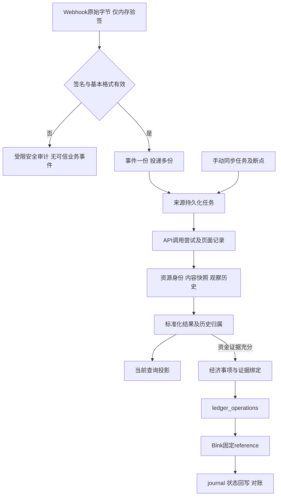

# Slash Webhook、API 来源持久化与 Blnk 可靠衔接

> 发布补注（2026-09-18）：下文静态调查针对共享工作区 `ce0a88a` 加未提交文件，不是最新远程 main。同步时核实 `78b05aa` 已包含渠道投影、采集器恢复、开户及用户目录；角色/Blnk 迁移正式编号为 004/006。保留原调查证据与哈希，不将旧工作区缺文件判断套用于发布源码；实施方案须先针对最新 main 复核差异。本次仅发布设计，不执行该方案的迁移、真实金融写入或生产账本激活。

日期：2026-09-18。状态：DESIGN，作为[集成总方案](slash-blnk-plan-2026-09-18.md)的“七、Slash Webhook 与 API 数据持久化”专项补充。本轮只交付设计，不创建/执行迁移，不修改业务代码，不启动消费者，不调用真实渠道写接口。

**推荐采用 PostgreSQL 来源收件箱 + 不可变观察历史 + 可重建查询投影 + 事务性任务表，复用现有 ledger_operations 和 Blnk 固定 reference 恢复。来源落库、规则判定、经济事项成立、Blnk 已应用必须是不同状态。** 不需要首期引入 Kafka，也不能用进程内队列、goroutine 或通知机制代替持久化任务。

## 1. 当前基础与兼容点

本次复查 HEAD `ce0a88a21b5b6c30a706e601827f45979622e78a`及未提交工作区：[004_blnk_shadow.sql](../../services/api/internal/database/006_blnk_shadow.sql)、[service.go](../../services/api/internal/ledger/service.go)、[client.go](../../services/api/internal/blnk/client.go)、[database.go](../../services/api/internal/database/database.go)。

| 已有能力 | 本设计如何使用 | 需要增加的边界 |
| --- | --- | --- |
| ledger_accounts | 保留钱包/卡/在途/客户级clearing及余额ID | 来源连接主档、资源身份和历史归属独立建表，不将共享来源账户复制到客户下面 |
| ledger_operations | 已有(namespace,effect_key)唯一、状态、attempts、next_attempt_at；作为Blnk持久化任务 | 新增同事务SubmitTx入口，或使用来源outbox反复调用现有幂等Submit；首选SubmitTx |
| ledger_evidence/journal/audit | 保留不可变证据、分录、状态审计；journal已保存reference和Blnk transaction ID | 增加有FK的来源证据关联；旧evidence_ref字符串继续可读 |
| Process/Apply | 客户advisory lock、事项行锁、固定reference、先查/失败后查、完整payload核验 | 复用；远端成功本地回滚继续可恢复；来源消费者不得绕过此唯一写入口 |
| Snapshot | Blnk与本地journal余额核对，失败不返回0 | 增加来源完整性/时点查询及逐笔核对，不能把来源快照写成Blnk余额 |
| 迁移机制 | 001/003/004采用checksum，显式执行 | 追加迁移文件，编号实施时确认；不修改004，不假设002渠道表存在 |

官方依据在本次重新查阅：[普通Webhook](https://docs.slash.com/api-reference/webhook-overview)明确非有序、非仅一次，原始字节RSA/SHA256验签，10秒内未获2xx会重试；[事件schema](https://docs.slash.com/api-reference/schema-webhook-event)是实体变化元数据，须另行GET实体。**后续GET只是被该事件触发的观察，不是事件发生时快照。** 固定OpenAPI与Blnk版本/摘要沿用同轮[核验清单](slash-blnk-research-2026-09-18.json)。

## 2. 分层与关联



核心关系：connection 1:N resource；event 1:N delivery；event N:M fetch（通过触发表）；fetch 1:N observation；resource 1:N observation；相同内容可由多个observation复用；observation 1:N mapping_run；economic_effect N:M observation；economic_effect 1:N ledger_operation（普通入账通常1:1，更正为另一个effect）；operation 1:N phase/journal。

共享池来源无customer_id。客户权限经内部归属与资源授权裁剪；交易经济事项确定customer和binding_version后不随当前卡归属改变。现有customer不是多租户tenant，不新增虚构tenant_id。

## 3. 表结构约定

以下为具体逻辑schema，**不是已创建的表或可直接执行的迁移**。除注明可空`?`外均NOT NULL；普通新表主键`id uuid`由服务端生成，审计大表可用`bigint GENERATED ALWAYS AS IDENTITY`。时间`timestamptz`存UTC；金额`numeric(38,0)`，汇率如需运算使用有界精确decimal，原始数字词法另存，不经float64。`text`字段设长度CHECK，ID最长按已核验上游界限配置，首期180字符；错误码80字符，路径模板200字符；不存任意错误响应。

通用`scope_id uuid`表示部署数据域（环境/运营法律实体边界），不是客户ID；`connection_id text`沿用现有ledger_accounts.connection_id字符串，namespace保持现有shadow含义。所有连接引用为`FK(scope_id,connection_id)`；共享资源、事件、观察及任务间引用用包含scope和connection的复合FK，避免只凭UUID跨范围关联。需要复合FK的目标均增`UNIQUE(scope_id,connection_id,id)`。从属表继承相同scope，业务代码不得自行填写其他scope。

摘要为`bytea CHECK(octet_length(...)=32)`；摘要算法/规范化版本单独保存。JSONB只接收版本化白名单字段，`jsonb_typeof(...)=object/array`按模型检查；JSONB本身不是安全白名单。数字由Go json.Number/精确十进制解析到JSONB，保留source数值类型；内部Money在独立派生列，不把内部字段写进source_payload。

CHECK/UNIQUE/FK承担单行/身份约束；跨行的归属、金额及状态转换在受控事务中验证，必要时触发器兜底。不能用CHECK读取别表保证跨行不变量。[PostgreSQL约束文档](https://www.postgresql.org/docs/17/ddl-constraints.html)

### 3.1 连接、资源及归属

| 表 | 字段与类型 | 唯一约束、索引与规则 |
| --- | --- | --- |
| source_scopes | id uuid PK；scope_key text；environment text；internal_legal_entity_ref text；created_at timestamptz | UNIQUE(scope_key)；环境为local_shadow/test/production_metadata等明确枚举，创建生产元数据不启用生产账本 |
| source_connections | scope_id uuid；connection_id text；provider text='slash'；provider_legal_entity_ref text；credential_ref text；verification_key_ref text；status text；created_at/disabled_at? timestamptz | PK(scope_id,connection_id)；引用秘密管理位置而非秘密值；同源凭据轮换复用connection_id。法律实体范围建立后不得静默修改 |
| source_resources | id uuid；scope_id/connection_id；resource_type text；external_id text；parent_resource_id? uuid；first_seen_at timestamptz；next_observation_seq bigint；fetch_fence bigint | UNIQUE(scope_id,connection_id,resource_type,external_id)；parent复合FK同连接；INDEX(scope_id,connection_id,resource_type,id)。resource_type含account/virtual_account/card/transaction/balance/fee_breakdown/utilization，不用名字猜身份 |
| source_resource_bindings | id uuid；scope_id/connection_id；resource_id uuid；customer_id uuid；internal_card_id? uuid；ledger_account_id? uuid；role text；valid_from timestamptz；valid_to? timestamptz；binding_version bigint；evidence_ref text；approved_by uuid；recorded_at timestamptz；supersedes_id? uuid | UNIQUE(resource_id,role,binding_version)；INDEX(resource_id,valid_from,valid_to)、(customer_id,role,valid_from)；CHECK(valid_to>valid_from)。独占卡owner同生效区间不重叠；锁资源后验证，生产前选用排斥约束/触发器加固；共享账户的多客户关联不是独占owner |
| source_read_grants | scope_id/connection_id；user_id uuid；resource_id uuid；permission text；valid_until? timestamptz | PK(scope_id,connection_id,user_id,resource_id,permission)；运营身份/MFA仍外层验证；grant不代表客户拥有池内全部资金 |

余额没有Slash通用balanceId：内部resource key使用带版本的无歧义元组编码`[accountId,balanceType]`，resource_type=balance，并设置`identity_basis=derived_composite`（source_resources额外text列）。不能声称此external_id来自Slash；币种由产品上下文决定，不因为未知币种而新建第二份同一余额。fee_breakdown使用其父费用transactionId作该响应资源身份；其items内fee ID单独保留。若费用item最终被证实为独立来源资源，再追加类型，不先认定独立资金事项。

归属变化采用追加版本；历史区间纠正追加supersedes记录并保存审批，不覆盖已引用binding。首期禁用卡改绑；不得只按当前绑定回放老交易。金额事项FK到确切binding_id；FK再校验绑定customer与operation.customer一致。共享来源快照通过一份资源记录关联多个客户，不能为权限方便复制金额后汇总。

### 3.2 Webhook事件、投递及安全审计

| 表 | 字段与类型 | 约束/索引/说明 |
| --- | --- | --- |
| slash_webhook_events | id uuid；scope_id/connection_id；external_event_id text；event_type text；entity_type text；external_entity_id text；source_event_at timestamptz；first_received_at/last_received_at timestamptz；verified_payload_id uuid；event_semantic_digest bytea；state text；last_error_code? text；process_attempts integer DEFAULT0；next_attempt_at? timestamptz | UNIQUE(scope_id,connection_id,external_event_id)；状态received/queued/processing/observed/review_required/dead_letter；INDEX(scope_id,connection_id,state,next_attempt_at)。semantic字段首次插入后不可更新；计数/状态可更新但有审计。process_attempts表示后台处理次数，不是投递次数 |
| slash_webhook_deliveries | id uuid；scope_id/connection_id；event_id? uuid；received_at timestamptz；local_trace_id uuid；source_event_at? timestamptz；verification_result text；verification_key_version text；verified_at timestamptz；body_digest bytea；body_size integer；safe_payload_id? uuid；semantic_conflict boolean；disposition text；intended_http_status smallint；error_code? text | 不对eventId/digest设唯一，每次接收一行；INDEX(event_id,received_at,id)、(scope_id,connection_id,received_at)。只有签名通过的交付进此表；schema不合格/未知类型可受限隔离，不进入可处理event。intended_http_status不宣称对方收到响应 |
| source_security_audit | id bigint PK；received_at timestamptz；endpoint_ref text；scope_id? uuid；connection_id? text；trace_id uuid；reason_code text；body_size integer；request_fingerprint? bytea；fingerprint_key_version? text；ip_token? text；rate_limit_bucket? text | 签名失败、超长、格式攻击、未知连接仅进本表或专用安全日志；INDEX(received_at)、(endpoint_ref,reason_code,received_at)。不存请求体/声明eventId/headers；连接未知为NULL，不信任payload指定连接 |

每一有效投递保存verification_result=passed和密钥版本；事件的可信性来自对应已验投递。无效请求只留下安全审计，不创建可信event/resource/observation/effect。签名通过但新事件类型无法路由时保存脱敏交付及隔离状态并2xx，避免无限重试；不会自动获得记账资格。

同eventId、相同语义：追加delivery，更新last_received_at，返回已持久化确认，不重复建fetch job。相同eventId但event/entity/source时间变了：追加冲突delivery及安全/质量告警，不覆盖原event；未知事件附加字段变化需schema评审，不能凭raw字节不同就断言攻击。首次有效event和其fetch job必须同事务写入。

### 3.3 API尝试、同步批次与断点

| 表 | 字段与类型 | 约束/索引/说明 |
| --- | --- | --- |
| source_sync_streams | id uuid；scope_id/connection_id；resource_type text；path_template text；query_scope jsonb；query_digest bytea；mapping_profile text；enabled boolean；checkpoint_revision bigint DEFAULT0；resume_cursor_ciphertext? bytea；cursor_key_version? text；committed_page_no bigint DEFAULT0；last_complete_run_id? uuid；last_success_at? timestamptz；coverage_state text | UNIQUE(scope_id,connection_id,resource_type,query_digest)；固定规范化查询和范围，改筛选新建stream；cursor运行使用加密值，日志只留摘要。last_success是采集成功时间，不是渠道业务水位 |
| source_sync_runs | id uuid；scope_id/connection_id；stream_id uuid；trigger text；requested_from/to? timestamptz；state text；coverage_state text；coverage jsonb；started_at/completed_at? timestamptz；last_committed_page bigint；scan_generation bigint；last_error_code? text | UNIQUE(stream_id,scan_generation)；INDEX(stream_id,started_at)、(state,started_at)。state queued/running/completed/failed/interrupted；coverage unknown/partial/complete_scope。completed≠全池完整 |
| source_fetch_attempts | id uuid；scope_id/connection_id；job_id uuid；run_id? uuid；attempt_no integer；method text='GET'；path_template text；path_resource_refs jsonb；query_safe jsonb；request_trace_id uuid；provider_request_id? text；cursor_in_digest? bytea；page_no? bigint；started_at/finished_at? timestamptz；http_status? smallint；result text；error_code? text；response_digest? bytea；response_bytes? bigint；received_item_count? integer；schema_profile text | UNIQUE(job_id,attempt_no)；INDEX(run_id,page_no,attempt_no)、(scope_id,connection_id,started_at)。尝试先提交再HTTP；进程中断留下started，恢复标outcome_unknown，不造success。provider_request_id只存真实返回且在header白名单内的值 |
| source_page_commits | id uuid；scope_id/connection_id；run_id uuid；attempt_id uuid；page_no bigint；request_cursor_digest? bytea；next_cursor_ciphertext? bytea；next_cursor_digest? bytea；cursor_key_version? text；accepted_items integer；quarantined_items integer；has_more_state text；committed_at timestamptz | UNIQUE(run_id,page_no)，UNIQUE(attempt_id)；FK到成功attempt；只有页面来源记录、隔离记录、normalize任务全部提交才插入；不会把失败页面插入为0条成功 |
| source_fetch_triggers | fetch_job_id uuid；event_id? uuid；sync_run_id? uuid；reason text；triggered_at timestamptz | 至少一个event/run；各非NULL引用有部分UNIQUE；触发记录只表示why-fetched，不表示at-event-time |

API路径存模板与受控资源ID，不记录带密钥完整URL；query_safe只保存已允许的账户/卡ID、时间范围、状态筛选、页大小等。授权头、Cookie、密钥query一律不存。cursor作为不透明数据单独加密，不落进可搜索query_safe。

新run第一页使用无cursor；重启根据该run最后已提交page继续；分页token失效则新scan_generation从原范围加重叠重新开始，不把旧cursor解释为业务位置。发生故障的run保留interrupted/partial，重扫取得新证据后才能改变新run的覆盖结论。

### 3.4 白名单载荷、观察历史及资源快照

| 表 | 字段与类型 | 约束/索引/说明 |
| --- | --- | --- |
| source_payloads | id uuid；scope_id/connection_id；resource_id? uuid；payload_kind text；source_payload jsonb；canonical_digest bytea；canonicalizer_version text；allowlist_version text；schema_profile text；source_schema_digest bytea；created_at timestamptz；retention_class text；expires_at? timestamptz | 资源载荷UNIQUE(scope_id,connection_id,resource_id,allowlist_version,canonicalizer_version,canonical_digest)（resource非NULL部分索引）；Webhook envelope另按事件资源键设计部分索引；同digest仍比较规范内容，冲突复核。只存裁剪后source字段，不冒充raw |
| source_observations | id uuid；scope_id/connection_id；resource_id uuid；local_seq bigint；payload_id uuid；fetch_attempt_id uuid；observed_at timestamptz；source_computed_at? timestamptz；source_business_at? timestamptz；previous_observation_id? uuid；content_changed boolean；validation_state text；quality_codes text[]；receipt_id uuid | UNIQUE(resource_id,local_seq)，UNIQUE(fetch_attempt_id,resource_id)；INDEX(resource_id,observed_at,id)、(fetch_attempt_id)、(validation_state,observed_at)。同页重复资源必须先归并一致项；不同内容同ID隔离整组，不靠行号造新资源 |
| source_receipts | id uuid；scope_id/connection_id；fetch_attempt_id? uuid；delivery_id? uuid；raw_digest_kind text；raw_digest bytea；digest_key_version? text；safe_payload_digest bytea；verifier_build text；schema_profile text；verified_at? timestamptz；verification_key_version? text；raw_retained boolean=false；attestation_key_version text；attestation bytea；created_at timestamptz | 一次来源接收的最小验收凭据；关联原文摘要与安全payload摘要、验证过程；仅一个fetch或delivery为父。服务签章证明系统接收/校验的声明，不能复验已丢弃原文 |
| source_quarantine_items | id uuid；scope_id/connection_id；fetch_attempt_id uuid；resource_type? text；safe_external_id? text；reason_code text；schema_profile text；field_path_codes text[]；safe_payload_id? uuid；created_at timestamptz；resolution_state text | INDEX(fetch_attempt_id)、(resolution_state,created_at)；未知字段只存名称/类型等安全形状，不存被禁字段值；不能decode的响应保存摘要及错误而非全文 |

`previous_observation_id`指本地观察链，不是Slash业务前一版本；按resource行锁分配local_seq，严格说明是落库观察顺序。相同内容再次GET仍新建observation以保留新鲜度和采集证据，可复用payload；不会把90天前曾出现的相同值当作“没采集”。A→B→A保留3次观察，可复用第1次A的内容，但不能丢掉回到A的第3次观察。

资源分别建不可变类型快照（以observation_id为PK，同时携scope/connection复合FK；resource_type在事务/触发器检查）。这些列是来源字段的有类型提取，解析依据可查；不混入客户归属和内部状态。全部来源细节以白名单source_payload为准。

| 表 | 来源提取字段及类型 | 索引与特殊要求 |
| --- | --- | --- |
| slash_account_snapshots | observation_id uuid PK；external_account_id text；source_type/status text；source_created_at? timestamptz；balance_types text[] | INDEX(scope_id,connection_id,external_account_id)；账号/路由号不存完整值 |
| slash_virtual_account_snapshots | observation_id；external_va_id/account_id text；account_type text；closed_at? timestamptz；balance_minor?/spend_minor? numeric(38,0)；各value_state text | INDEX(scope_id,connection_id,external_va_id)；缺Money为unknown，不补0；VA数据不冒充带timestamp的Balance |
| slash_card_snapshots | observation_id；external_card_id/account_id text；external_va_id?/card_group_id?/product_id? text；source_status text；last4? text；spending_constraint_safe? jsonb | INDEX(scope_id,connection_id,external_card_id)；不保存PAN/CVV/OTP/userData任意扩展 |
| slash_transaction_snapshots | observation_id；external_transaction_id text；external_account_id_safe? text；external_card_id?/va_id? text；source_status/detailed_status text；signed_amount_minor? numeric(38,0)；amount_state text；source_date?/authorized_at? timestamptz；original_code? text；original_amount_token?/conversion_rate_token? text；provider_authorization_id? text；fee_relation_id? text | INDEX(scope_id,connection_id,external_transaction_id)、(scope_id,connection_id,source_date)、(external_card_id,source_date)；accountId非预期类型隔离；USD/scale2的派生依据在mapping中保存 |
| slash_balance_snapshots | observation_id；external_account_id/balance_type text；available_minor?/posted_minor? numeric(38,0)；available_state/posted_state text；source_timestamp? timestamptz | INDEX(scope_id,connection_id,external_account_id,balance_type,source_timestamp)；相同时点重复仍保留观察；同timestamp不同金额标conflict，不能last-write覆盖 |
| slash_fee_snapshots | observation_id；parent_fee_transaction_id text；items_safe jsonb；item_count integer；sum_fee_minor? numeric(38,0)；amount_state text | 父费用资源的整份breakdown快照；items保持fee ID/date/type/original transaction/card安全关联；数组每项不自动作为ledger effect |
| slash_utilization_snapshots | observation_id；subject_type text；external_subject_id text；spend_minor?/available_limit_minor? numeric(38,0)；next_reset_at? timestamptz；对应value_state text | 卡/卡组分资源；available字段缺失不记0，不作为真实余额；无来源timestamp则NULL |

每个数值对满足`(state='known') = (value IS NOT NULL)`；state为known/unknown/not_applicable/unsupported/unavailable。畸形金额进入quarantine，而非把无效数当known。快照不因下一次失败被写成unavailable零值；失败状态属于采集和当前读取健康状态，旧成功快照保留真实金额及时点。

### 3.5 标准化、投影及经济事项

| 表 | 字段与类型 | 约束/索引/说明 |
| --- | --- | --- |
| source_mapping_runs | id uuid；scope_id/connection_id；observation_id uuid；mapping_version text；policy_version text；binding_id? uuid；binding_basis text；rule_input_digest bytea；mode text；result text；reason_codes text[]；normalized_payload jsonb；started_at/completed_at timestamptz | UNIQUE(observation_id,mapping_version,policy_version,rule_input_digest,mode)；mode projection_only/accounting_candidate；result non_posting/eligible/review/invalid；规则输入摘要含明确binding版本，不包含会改变E的随意字段 |
| source_current_projections | resource_id uuid；projection_schema_version text；scope_id/connection_id；selected_observation_id uuid；mapping_run_id uuid；projection_revision bigint；data jsonb；quality_state text；selection_reason text；selected_at timestamptz | PK(resource_id,projection_schema_version)；读模型可重建；CAS revision防旧worker覆盖新结果。selected代表内部选择，不是Slash权威version |
| economic_effects | id uuid；scope_id/connection_id；namespace text；resource_id uuid；economic_component_key text；effect_key text；kind text；customer_id uuid；binding_id uuid；source_account_id/destination_account_id uuid；signed_amount_minor numeric(38,0)；currency text；scale integer；immutable_request_digest bytea；first_mapping_run_id uuid；correction_of_id? uuid；approval_ref? text；created_at timestamptz | UNIQUE(namespace,effect_key)；UNIQUE(namespace,resource_id,economic_component_key)；INDEX(customer_id,created_at)、(resource_id)。普通卡posting component='posting'固定；不带mappingVersion/eventId/金额；部分capture仅渠道证据确定后扩展 |
| economic_effect_evidence | effect_id uuid；observation_id uuid；mapping_run_id uuid；binding_id uuid；evidence_role text；created_at timestamptz | PK(effect_id,observation_id,mapping_run_id,evidence_role)；复合FK限定scope/连接一致；追加证据不改既有经济金额 |
| economic_effect_operations | effect_id uuid；operation_id uuid；operation_role text；created_at timestamptz | PK(effect_id,operation_role)，UNIQUE(operation_id)；普通role='posting'，可关联旧operation；namespace/customer/币种/账户/金额必须匹配，可用复合唯一键+FK及事务校验 |
| economic_effect_aliases | namespace text；alias_type text；alias_key text；effect_id uuid；created_at timestamptz | PK(namespace,alias_type,alias_key)；保存旧effectKey、经验证的同源迁移身份/内部请求关联；不能无证据合并两个来源 |

economic_effects的signed_amount是业务方向；ledger_operations金额仍正值、source/destination决定方向。退款和原消费各有自己的effect；退款父关系单独存证据，不能靠original ID令多个退款互相去重。纠正用新的economic_component_key=`correction:<批准ID>`及correction_of_id，原effect不可改。普通来源金额变化不能直接分配一个新component绕过去重。

与已有账本兼容：保持`slash_posting_+hash(connectionId,transactionId)`和`mv_+hash(namespace,effectKey,phase)`原算法；namespace现有唯一索引也确保该namespace内connectionId不含糊。同namespace不能同时接入两个scope中同名但不同来源的connection；导入前检测并拒绝。需要改变来源连接命名时先迁移alias，不能换键重放已记流水。

### 3.6 持久化任务与尝试历史

| 表 | 字段与类型 | 约束/索引/说明 |
| --- | --- | --- |
| source_jobs | id uuid；scope_id/connection_id；job_type text；job_key text；event_id? uuid；sync_run_id? uuid；observation_id? uuid；effect_id? uuid；input_refs jsonb；state text；attempts integer；next_attempt_at timestamptz；lease_owner? text；lease_token bigint；lease_until? timestamptz；last_error_code? text；created_at/updated_at timestamptz | UNIQUE(scope_id,connection_id,job_type,job_key)；类型fetch_event/fetch_page/normalize/rebuild_projection/enqueue_ledger；四个subject列各自复合FK且恰好一个非NULL，CHECK其与job_type对应；部分INDEX(next_attempt_at,id) WHERE state IN ('ready','retry_wait')；部分INDEX(lease_until) WHERE state='running' |
| source_job_attempts | job_id uuid；attempt_no integer；lease_token bigint；started_at timestamptz；finished_at? timestamptz；result text；error_code? text；trace_id uuid | PK(job_id,attempt_no)；过期running尝试标abandoned/unknown；历史不可覆盖为从未发生 |
| source_state_history | id bigint PK；scope_id/connection_id；subject_kind text；subject_id uuid；old_state?/new_state text；reason_code? text；job_attempt_id? text；actor_ref text；recorded_at timestamptz | INDEX(subject_kind,subject_id,id)；受控enum和引用验证；记录人工重新排队/解封，不直接悄悄改状态 |

source_jobs就是数据库outbox/任务队列，任务payload仅ID引用及固定规则版本，不嵌秘密或整份响应。账务执行继续扫描ledger_operations，无需再造一份具有不同成功状态的Blnk队列。若额外唤醒消息丢失，定时扫描仍能发现持久化任务；LISTEN/NOTIFY仅可降低延迟，不承担可靠性。

## 4. 事务边界与崩溃恢复

### 4.1 T1：Webhook接收

1. 服务端endpoint→connection映射；限流、Content-Type/长度限制，原始body只在有界内存读取。不先JSON重编码后验签，不记录headers或body日志。
2. 原始字节RSA/SHA256校验，密钥来源受控；验签失败进入安全审计路径，返回4xx，绝不创建来源任务。验签成功后解析基本envelope，执行白名单与schema检查；禁止敏感字段即使签名正确也落盘。
3. BEGIN：插入/查冲突event；追加delivery、receipt与安全envelope；首次事件插入fetch_event job及trigger；记录状态历史；COMMIT。
4. 只有COMMIT确认成功才返回2xx。提交结果未知返回503，重投后由唯一键判定是否已落库。签名通过但不支持的事件入受限隔离记录后2xx，处理状态不是成功记账。
5. 主数据库不可用：不2xx、不把内存任务当已接收。安全日志系统如可用只记录无载荷trace/reason；恢复后依赖Slash重投+手动补同步。无法承诺所有失败交付都存在主库，交付计数明确为“本系统持久化观察到的次数”，不是Slash总投递次数。

事件插入冲突不能先`SELECT不存在`再裸INSERT；用唯一约束+ON CONFLICT，再严格比对event语义。已存在且处理失败的重复交付不重置attempts或绕过退避；保留原job重试。首次event与job同事务保证event存在就有可恢复任务。

### 4.2 T2/T3：任务领取、API调用和页面提交

T2短事务：选择到期任务`FOR UPDATE SKIP LOCKED`，CAS状态/lease_token，写attempt，提交；随后发只读HTTP，**不持数据库事务等待Slash网络**。SKIP LOCKED仅用于队列领取，不用于账户余额或完整对账查询。[PostgreSQL SELECT](https://www.postgresql.org/docs/17/sql-select.html)

返回后T3事务：锁job并验证lease_token仍有效；记录fetch结果；逐资源插入白名单payload、receipt、observation及类型快照；坏记录插入quarantine；插入每个有效observation的normalize任务；成功页面插入page_commit；CAS推进run/stream checkpoint_revision；将本任务完成及下一页任务一起写入；COMMIT。

页面无法安全解析/完整接收：整页失败，不推进cursor。可逐项安全隔离的局部错误：页面记录accepted/quarantined计数，允许推进避免毒数据阻塞，但run.coverage=partial，保留待修复任务，不能宣称该页业务全部成功。固定每页大小上限；大页面若必须分块，增加page-staging清单，所有chunk落库并校验项目总数/摘要后才推进断点，不能按首块成功前移cursor。

T3提交失败或进程退出：同页重拉。旧成功page_commit与任务唯一键使重复提交无新业务影响；不同attempt获得不同时间的响应可以新增观察，但只有有效fencing持有者推进断点。租约过期旧worker返回的结果不得覆盖checkpoint/当前投影，可追加为superseded_attempt证据并受限处理；不能让迟到worker自动创建新账务事项。

首期每事件独立fetch job，重复事件不重复任务；不急于做复杂合并队列。相同资源的读后映射串行化，但列表采集可能与详情GET重叠，全部观察可保留。更晚observedAt不证明更晚业务状态；posted之后观察到pending或不同金额必须review/重拉，不简单last-write-wins。普通非金融资料的当前投影也标观察区间与质量状态，不宣称全局原子快照。

### 4.3 T4：标准化 → 经济事项 → 记账任务

规则判定有三种结果：non_posting只建查询投影；review/invalid保留异常及来源；eligible才可生成经济effect。签名通过、来源HTTP200、数据入库都不等于eligible。资金事实还需合法币种/金额/状态组合、可信历史归属、去重身份及经过核验的规则。

**首选原子方案：引入SubmitTx(ctx, tx, command)，保留Submit作为开事务包装。** 公共校验、客户锁、账户校验、幂等冲突比较必须复用，不能为同事务入口绕过。T4按统一锁顺序（当前job行→客户账本锁→来源资源锁→经济事项→operation）执行；T3同样先锁当前job再锁资源，跨多个资源按稳定ID排序：

```text
BEGIN
  校验normalize任务lease_token、固定observation/规则/归属版本
  INSERT mapping_run；按projection revision发布读模型
  如果eligible：
    INSERT economic_effect ON CONFLICT → 逐字段核对旧内容
    INSERT effect_evidence（可追加不同来源观察）
    SubmitTx → ledger_operations + ledger_evidence
    INSERT effect_operations + 结构化来源关联
  标记normalize任务完成；写处理历史
COMMIT
```

同库原子提交意味着不存在“eligible effect已提交但operation没入库”的成功状态。映射任务即使在Blnk之前完成，也只表示记账已排队；客户端资金结果继续读取ledger operation/journal。

兼容备选：若首批不改Submit签名，T4仅原子写effect+`enqueue_ledger`来源outbox；worker以固定effectKey调用现有Submit，返回后绑定operation。Submit成功后worker崩溃，下次同键调用获取同operation，再补关联。此方案也可靠，但多一个排队中状态和恢复环节；**不能采用effect提交后直接调用Submit却不留outbox的中间方案**。

争抢同一交易：Webhook来源观察和API列表观察分别有mapping_run，但争用同一effect唯一键；赢者创建operation，另一个核对金额/归属/账户一致后追加证据。不同内容不吞冲突，进入review，不创建第二笔operation。来源pending到posted即使多个观察也只有一个最终posting effect。

### 4.4 T5：Blnk及本地回写

继续现有Process：客户锁+operation行锁→算固定reference→Apply先查/必要时发送→只接受APPLIED且账户/币种/precision/precise_amount一致→同事务写journal、operation状态及audit。现有代码在该事务内做有界Blnk网络调用；这是当前正确性基线，首批不同时重写租约式账本执行，后续压测再优化。

reference确定于operation.effectKey+namespace+phase，**在网络调用前可重算**。本地journal尚无远端transaction ID时仍能恢复；无需为保存ID另造临时分录。推荐只读视图`ledger_phase_status`由operation生成候选phase/reference，再LEFT JOIN journal显示transaction ID；不把派生视图当第二套任务状态。记录请求摘要时只含安全账户ID、币种、precision、整数金额与reference。

Blnk超时/502或本地COMMIT失败：保持未完成/未知，先查询原reference；查询precision缺失继续按ID读取完整对象。404不证明此前POST永久未执行；只在可重试时以**相同reference和相同payload**再次请求。APPLIED补回本地记录；QUEUED/INFLIGHT仍未知；异payload转review；不可新reference“再试一次”。来源任务重跑不绕过此路径。

## 5. 断点、重试和去重的具体规则

| 对象 | 去重身份 | 重试/恢复 |
| --- | --- | --- |
| Webhook事件 | scope+connection+eventId | 多delivery一event；签名失败没有业务event |
| 内容快照 | resource+白名单版本+规范化版本+安全内容摘要 | 仅复用内容存储，不合并独立观察；A→B→A保留全部观察 |
| 采集页面 | run+page_no；attempt另有唯一ID | 页提交与checkpoint CAS/下一页任务同事务；cursor失效新generation重扫 |
| 标准化 | observation+mapping/policy+固定规则输入摘要+mode | 相同输入可恢复；规则升级新mapping，不改变原经济E |
| 经济事项 | namespace+稳定effectKey，另有resource+component唯一 | 不含通知ID/金额/规则版本；重复核payload，不同payload复核 |
| Blnk动作 | namespace+effectKey+phase哈希reference | 同reference查回并核验；只有APPLIED入journal |

source_jobs候选退避：指数退避起始5秒、上限15分钟，full jitter；429在有合法Retry-After时优先遵守并对连接限流；5xx/连接错误/暂时DB错误可重试；401/403进入connection_blocked，凭据修复后受控恢复，不能死循环；schema/单位/身份冲突review_required；404先区分权限/未可见/删除，有限重查后调查，不删除历史。

候选10次自动尝试后转dead_letter+告警，数据和任务不删除；人工重试新增历史并保持job_key，不能换effectKey。Blnk结果未知**不能**因到次数上限变成明确失败/释放；转人工待核查后仍保留原reference、预占和资金风险。

租约示例60秒、请求时限低于租约，工作较长需带token续约；旧token禁止最终状态/断点写入。任务超时由reaper回收到retry_wait，attempt保留abandoned。PostgreSQL死锁/序列化失败重跑整个事务，禁止只重跑某条INSERT；所有worker遵守同一锁顺序。

同步stream是固定过滤范围的进度，不是来源真实版本；维护`last_page_committed_at`、`last_success_at`、`last_complete_run_id`和带范围的coverage，不能只存一个last_sync_at。先实现手动同步/重叠回扫任务，继续既有手动同步策略；常驻定时采集另行批准。

历史重放默认mode=projection_only，只读来源历史重建新版本投影；运行角色无SubmitTx/Blnk执行权限。升级规则发现以前遗漏的真实资金事实时，生成独立catch-up候选清单，核期初/切点/旧effect别名，经授权后进入accounting_candidate。更正必须有correction_of/审批及独立新effect，不从重放模式直接改账。

## 6. 安全、载荷证据与生命周期

### 6.1 可保存字段白名单

| 数据 | 可保存 | 默认排除/处理 |
| --- | --- | --- |
| 普通Webhook | event/eventId/entityId/eventTimestamp；验签结果/公钥版本/接收时间/安全摘要 | 全部其他扩展默认排除；Authorization/Cookie/密钥头不记录 |
| 账户/VA | 来源ID、产品、状态、上下级、时点、余额类型、安全金额 | 完整accountNumber/routingNumber排除或按批准规则仅掩码；名称仅在确有展示需求时受控保存 |
| 卡 | ID/account/VA/group/product、status、last4、创建时间、白名单限额 | PAN/CVV/OTP永不保存；请求不带include_pan；userData不整体入库；不扩大敏感卡信息 |
| 交易 | 标识/金额/原币/汇率/两层状态/时间、白名单关系和商户分类 | memo/description等自由文本默认不保存；有必要时先脱敏并限制长度；禁止未经裁剪附加对象 |
| 费用/余额/utilization | 精确金额、类型、时点、关联ID、费类型、周期/时区/规则 | 不存未知嵌套对象；来源缺currency不补造来源字段 |
| 请求与错误 | GET路径模板、安全筛选、cursor摘要、真实追踪ID、状态码、分类错误码 | 不存完整URL/headers/异常原文/错误body/SDK调试dump |

source_payload是字段白名单复制，不是“完整响应减几个黑名单字段”。未知字段仅记录字段路径/类型变化供调查，值丢弃；若将来需要字段，先审白名单并增加版本，再重新授权采集。实现需禁反向代理/APM/HTTP调试器记录原文，测试恶意敏感字符串不会出现在DB、日志、trace、异常和Blnk metadata中。

### 6.2 原始字节与证据强度

原始body只在有界内存验签，完成后丢弃，不写临时文件。默认`raw_retained=false`。可保存的凭据：安全payload、其规范摘要、原文不可逆摘要、body长度、验证算法/密钥版本/服务构建及时间、接收结果服务签章。对包含敏感候选内容或不可信请求使用HMAC摘要及版本化审计密钥，避免普通哈希被枚举；不记录具体命中敏感值。密钥只在KMS/秘密管理，DB存key引用。

**脱敏payload不能复验Slash原始签名，原文摘要也不能重建原报文。** 服务签章仅证明Moventra当时声明完成何种校验。若未来审计明确要求逐字节复验，只能另审严格白名单普通事件envelope的原文保留方案；涉及PAN/CVV/OTP/凭据的原文仍不得保存，不能以“加密归档”绕过禁存。本轮默认不保留任何完整原文。

来源表服务端访问；客户只读已授权投影。采集角色写来源/任务而不能调用Blnk；映射角色按固定流程建候选；账本角色唯一执行；重放角色只写投影；运营证据读取需要独立grant+MFA+审计。来源历史表禁止普通UPDATE/DELETE，派生投影可替换；清理使用独立受审计角色并受legal hold/证据引用检查。

传输TLS，数据库磁盘/备份加密，含个人信息字段与cursor用KMS信封加密或等效应用层保护；密钥按环境隔离、轮换留key version。安全载荷如采用应用层密文替代JSONB，字段索引只保留批准的非敏感提取列，不为搜索另建明文全副本。审计导出字段裁剪，访问日志不写载荷；摘要和资源ID同样按敏感元数据控制。

### 6.3 保留与清理（候选工程政策，非已确认法规期限）

| 数据类别 | 候选保留期限 | 清理条件与保留内容 |
| --- | --- | --- |
| 无效请求安全审计 | 30天；发生调查则hold | 到期删除token/安全记录，保留无个人数据聚合指标；限流防日志膨胀 |
| 普通delivery/API尝试明细 | 热存90天，脱敏归档至1年 | 未解决失败/争议/关联账务不得删关键证据；归档后可按ID取回，不断FK |
| 无资金关系账户/卡/余额/费用观察 | 热存至少90天，候选归档1年 | 快照按观察批次归档；保留当前读模型依据与覆盖清单。余额须先满足对账回溯期，不能只留最新一条 |
| 与资金事项相关的来源快照/receipt/归属/规则判定 | 候选与账务证据同保留周期，初议7年，待业务及合规确认 | 完成确认前禁自动销毁；保留最低充分脱敏事实及可读取归档；不是未经核验的法律结论 |
| effect/alias/reference/journal/纠正链 | 活跃账本及允许历史重放期间保留 | 去重身份不随payload期限一起删除；账本整体退役再制定处置，不让旧数据重放重新扣款 |
| event去重身份 | 至少覆盖可重放/上游重试期限；当前上限未证实，先保留最小身份墓碑 | 删除完整delivery后仍保留eventKey/安全语义摘要及处置，不因归档再次创建同event |
| 已完成job/attempt | 热存90天，关联来源按以上期限归档 | 保留job去重键/完成墓碑或可重建证明；未完成、unknown、dead_letter不按普通TTL删除 |

清理分“归档”“载荷到期裁剪”“删除去重身份”三个操作，禁止CASCADE删除账务证据链。先写purge_manifest（对象ID、原因、策略版本、审批、摘要、时间、归档引用），校验备份/归档可恢复及未被hold后再裁剪；源记录保留`payload_state=archived/purged`与locator，不能只置NULL冒充从未采集。source_payloads需增payload_state/archived_locator?及purged_at?列，与source_payload NULL条件配套；到期裁剪走审计管理流程，不使用普通写角色。

初期不对带全局唯一去重键的event/effect表直接按月分区，否则可能破坏跨分区唯一身份。大表需要分区时将全局identity注册表保留不分区，仅delivery/attempt/内容归档分区，另行验证FK、索引和保留策略。规模未实测，不宣称该设计已满足全量性能。

## 7. 缺失、失败、过期与真实零

响应示例为拟议查询契约，不改变既有/ledger字段：

```json
{
  "value": {"state": "known", "amountMinor": "0", "currency": "USD", "scale": 2},
  "sourceComputedAt": "2026-09-18T00:00:00Z",
  "observedAt": "2026-09-18T00:00:02Z",
  "freshness": "stale",
  "latestFetch": {"state": "failed", "reason": "upstream_timeout"},
  "coverage": {"state": "partial", "reason": "page_interrupted"}
}
```

此例表示“曾确认0，但最新采集失败且过期”，不能显示实时0。没有历史快照为value.unknown，依赖不可用但允许旧数据时保留旧value+stale；无可用数据需按接口返回503或结构化unavailable。known必须value非NULL，非known必须NULL；currency未确认时该资产Money整体unknown并展示原因。unknown金额不参与全量合计，输出partial和排除范围。查询projection不能因为fetch超时用空对象覆盖上次成功。

## 8. 验收与故障注入设计

以下是必须运行的验收，不是本轮已通过的结论。准备隔离DB/真实本地Blnk时必须获得后续实施授权；禁止测试脚本默认读取生产环境变量。

| ID | 注入及执行 | 必须观察到的证据与断言 |
| --- | --- | --- |
| PERSIST-01 | 同一合法Webhook并发投递10次 | events=1、deliveries=10、fetch_event job=1；标准posted最终effect/operation/journal各1；余额仅扣一次 |
| PERSIST-02 | Webhook详情GET与手动API列表同时发现同posted交易 | 两个fetch/observation及证据，单一effect/operation；金额和账户一致合并，异payload进入review，不能第二次扣款 |
| PERSIST-03 | T1提交后、发送HTTP应答前kill | 重投新增delivery不新建event/job；重启扫描继续；若T1未commit，任何资金任务都不存在 |
| PERSIST-04 | T3来源页commit后、normalize执行前kill | 来源、断点、normalize job均存在；重启完成T4；对比事务回滚用例，cursor未前移且可重拉 |
| PERSIST-05 | T4提交前后kill | 前：effect/operation一起回滚；后：operation可Drain，不依赖内存；备选outbox模式验证Submit成功后绑定失败仍复用同operation |
| PERSIST-06 | Blnk APPLIED后注入journal/本地COMMIT失败并重启 | 查询原reference取回同transaction ID；补写一份journal；Blnk交易数和总扣款不增加；恢复前核对显示mismatch/待恢复 |
| PERSIST-07 | 来源A→B→A，包含pending→posted→旧pending、同ID异金额 | 3次观察、2份内容允许复用；已有入账不倒退或再扣；更正必须另审批；观察序号不标来源version |
| PERSIST-08 | projection_only历史重放、mappingVersion升级、旧effectKey升级 | 可新增mapping/投影；Blnk调用0、余额不变；legacy alias有效；catch-up明确独立审批 |
| PERSIST-09 | 同事件ID不同entity；无效签名；原文有PAN/CVV/OTP/凭据诱饵 | 冲突不覆盖事件；无效无可信event/effect；DB/日志/trace/错误/Blnk均无敏感诱饵，只有受限安全摘要 |
| PERSIST-10 | DB离线、commit结果未知、Webhook乱序、下游处理失败 | DB不可用不2xx；重复恢复不丢job；源时间不当快照版本；失败/次数/下次重试可查，后台失败不要求Slash无限重投 |
| PERSIST-11 | 分页中断、毒记录、cursor过期、lease过期旧worker晚回 | checkpoint仅随成功页面提交；毒记录使coverage partial；旧token不改断点/投影；重扫不重复资金影响 |
| PERSIST-12 | 从未采集、明确0、旧0后超时、同timestamp不同金额 | 四种情况可区分；缺失不补0；旧0显示stale；冲突复核不静默覆盖 |
| PERSIST-13 | 共享池两客户读取、卡改绑后老退款、不同连接同ID | 来源资源只一份；授权字段裁剪；历史绑定不改写；不明退款归属review；跨scope/连接FK或服务拒绝 |
| PERSIST-14 | 清理到期payload后历史重放、备份恢复 | event/effect/reference墓碑仍阻止重复；归档可定位，purged不伪装unknown；恢复前对账水位，不能以旧应用DB重放再次记Blnk |
| PERSIST-15 | 两worker抢任务、死锁重试、amount超JS安全整数及38位边界 | lease/fencing有效；统一锁顺序；全事务重试；原值精确、异常拒绝，流水双边一致 |

实施时记录SQL计数、原/恢复后Blnk reference及ID、journal条数、精确余额、checkpoint revision、任务尝试、source observation链与跨客户拒绝证据。只有Mock成功不证明PostgreSQL事务、真实Blnk恢复或真实Slash验签；三层验收分别报告。

## 9. 实施文件与最小批次

| 批次 | 拟涉及文件 | 范围/兼容 |
| --- | --- | --- |
| A 来源持久化 | 新`services/api/internal/slash/{repository,allowlist,webhook,fetch,sync,worker}.go`及测试；新增量SQL（编号复查）；database.go注册 | scope/connection/resource、event/delivery/security、payload/receipt/observations及类型快照、job/fetch/run/checkpoint；先合成数据与手动任务 |
| B 标准化桥接 | 新`internal/slash/{mapping,projection}.go`；新`internal/ledger/{effects,ownership}.go`；service.go增加SubmitTx并保留Submit；events.go扩证据检查 | 本设计T4原子链；保留旧effectKey/reference及当前只允许最终posted的规则；不开放费用/争议未知路径 |
| C 查询/验收 | 新来源状态/快照/任务只读handler与机器契约；共享transport、网关精确GET规则及后台证据详情 | 现有/ledger仍只报告既有影子账本；新来源完整性独立契约；运营MFA/独立grant/客户裁剪 |
| D 运维与生命周期 | worker手册、重试/死信/归档/恢复工具，负载及权限测试 | 不默认开启生产或定时同步；保留策略和7年候选期限需业务/合规明确；未知事项不自动释放 |

最小首批可暂不实现完整财务对账UI或渠道执行，但**不能删掉event/delivery分离、来源历史、checkpoint事务、normalize任务、经济唯一键或Blnk恢复**。这六项是可靠性基础。各资源类型快照可在一份增量schema中统一落地，不在每个前端页面重复保存来源副本。

本轮交付：设计文档及总方案链接；本地业务实现、迁移、集成测试、真实渠道验证、部署均未执行。前轮测试仅为前轮证据，不覆盖本次新增持久化设计。待确认实施范围后，再生成迁移与测试代码。
